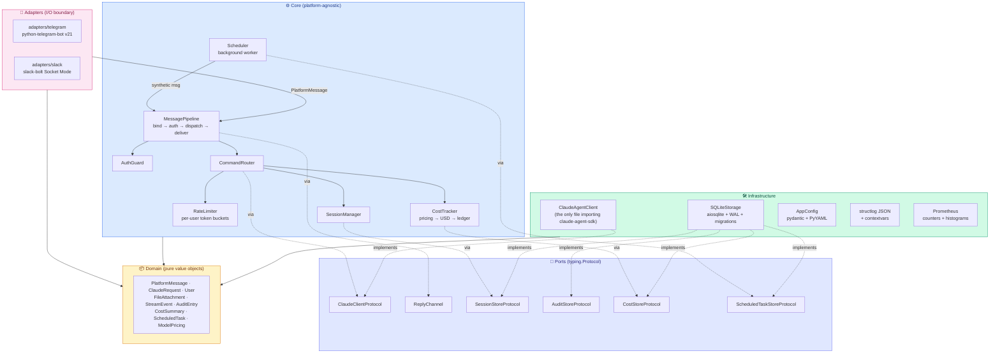
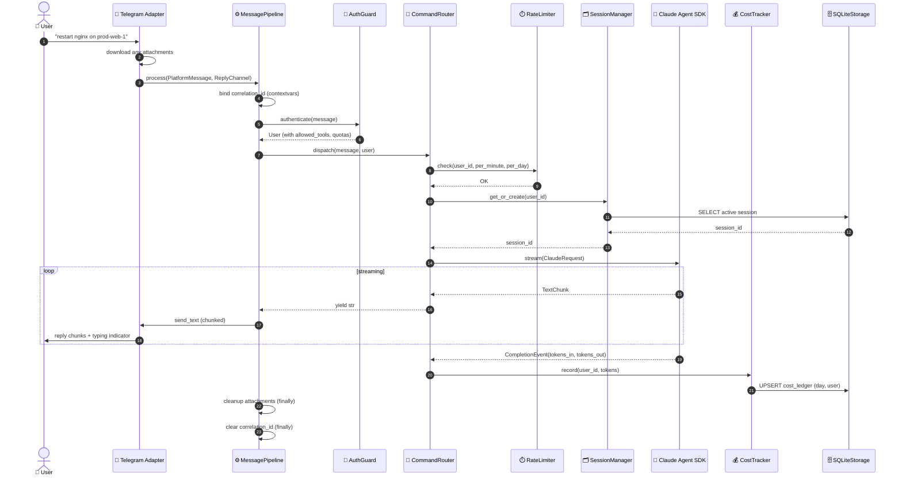

<div align="center">

# 🤖 datronis-relay

### Production-grade chat bridge between Telegram/Slack and the Claude Agent SDK — with a Next.js admin dashboard

**Run Claude Code from your phone. Control your servers from anywhere.**
### ⚡ Stop paying Anthropic twice for the same AI. ⚡

[](https://www.python.org/)
[](./ui)
[](./ui/tsconfig.json)
[](./LICENSE)
[](./docs/api_reference.md)
[](http://mypy-lang.org/)
[](https://github.com/astral-sh/ruff)
[](./tests)
[](./ui/tests)
[](./docs/performance.md)
[](./ui/messages)
[](./docs/versioning.md)
[](./Dockerfile)
[](./.github/workflows)

</div>

---

## 💀 Stop paying twice for Claude

You pay Anthropic **$20 a month** for Claude Pro. You love Claude Code on your laptop. You want to use it from Telegram too, so you go install a self-hosted Claude chat bot. It asks for an `ANTHROPIC_API_KEY`. You paste one in. Your Anthropic Console bill starts climbing.

**Congratulations. You're now paying Anthropic twice for the same AI.**

Every other self-hosted Claude wrapper does this to you. **datronis-relay is the only one that doesn't.**

### 💸 The math everyone else hides from you

| Your setup | Claude subscription | Typical API-key bot (overage) | **With datronis-relay** | You save |
|---|---:|---:|---:|---:|
| 👨‍💻 Solo dev on **Claude Pro** | $20/mo | **+$15/mo** | $20/mo — *that's it* | **$180 / year** |
| 👥 Team of 3 on **Claude Teams** | $90/mo | **+$80/mo** | $90/mo — *that's it* | **$960 / year** |
| ⚡ Power user on **Claude Max** | $200/mo | **+$120/mo** | $200/mo — *that's it* | **$1,440 / year** |

> **One `claude login` command. No API key. No token metering. No overage bills. No key rotation ceremony when a teammate leaves. Just your subscription — working in more places.**

### 🔐 And the parts that aren't about money

- 🗝️ **No API keys to leak into git.** OAuth credentials live in `~/.claude`. They never touch a `.env` file, an environment variable export, or a Dockerfile.
- 🔄 **No key rotation when someone leaves the team.** There is no key. You remove them from `config.yaml`, done.
- 💥 **No 3am wake-up calls because a retry loop burned through your monthly API budget.** You can't burn through a subscription.
- 📜 **No compliance argument about LLM token billing.** The tokens bill to your existing Claude plan — on the invoice you already approve every month.

### ⭐ Plus everything else you'd expect from a production-grade service

- 📱 **Chat from your phone, tablet, or desk** — Telegram and Slack today; Discord next.
- 🌐 **A real admin dashboard** (Next.js 15 + Radix UI) — users, scheduled tasks, adapter health, cost explorer, audit log, and live config. **No more SSH + YAML**.
- 🌍 **6 languages out of the box** — English, Deutsch, Español, Français, 中文, 日本語. Your on-call team doesn't have to speak English.
- ⏰ **Scheduled recurring tasks** — *"Every morning at 8am, check disk space and ping me if over 80%"* — one chat command, one bot, forever.
- 💰 **Per-user cost tracking** — token counts and USD spend, filtered by today / 7d / 30d / all-time, with CSV export.
- 📊 **Cursor-paginated audit log** — every message, every Claude call, every tool invocation, append-only in SQLite.
- 🛡️ **Hardened for production** — structured JSON logs with correlation IDs, Prometheus metrics, STRIDE threat model, `NoNewPrivileges=yes` systemd unit, multi-stage Docker image, non-root user, read-only rootfs.
- 🧪 **~230 tests** across backend and frontend — `mypy --strict`, `ruff`, `eslint`, zero `any`, zero warnings, zero flakes.
- 🚀 **Installed in under 5 minutes** — `datronis-relay setup` installs the Claude Code native binary, runs `claude login` with a **terminal-side QR code** (so the OAuth URL is copy-pastable on headless servers), writes your config, and installs a hardened systemd unit. Done.

**And that's before we talk about the web dashboard, the audit log, the 6 locales, and the scheduled tasks.**

---

## ⚡ Right now, while you're reading this

**Every day you don't have datronis-relay, at least one of these is happening on your team:**

- 🗝️ **Somebody is about to commit `ANTHROPIC_API_KEY=sk-ant-...` to git.** One grep, one leaked key, one compromised org. → *Solved: subscription OAuth lives in `~/.claude`, never in env files, never in source control, never in a `.env.local` shared on Slack.*
- 💸 **Your pay-per-token chat bot is burning credits on a retry loop you don't know about** — you'll see it when the monthly invoice arrives. → *Solved: no API key, no per-message billing, no surprise overage.*
- 📱 **Your on-call engineer is SSH-ing from a phone at 2am**, typing `tail -50` on a 4-inch screen, praying they don't typo `rm`. → *Solved: `"explain the last 50 lines on web-1"` via Telegram.*
- 📋 **Your compliance review is about to ask "where's the audit log for LLM-driven operations?"** You don't have one. → *Solved: SQLite append-only audit log with correlation IDs, cursor pagination, filterable by user / event / date range.*
- 🌍 **Your Spanish-speaking junior SRE is pasting your English-only admin panel into Google Translate.** → *Solved: 6 locales shipped — en / de / es / fr / zh / ja — locked by a key-parity test that fails CI if any locale drifts.*
- ✏️ **You're editing `config.yaml` over SSH to add a new user.** Again. With no validation. No audit trail. No rollback. → *Solved: Next.js 15 admin dashboard with zod-validated forms and a real audit log.*
- 🔁 **Your teammate left three months ago and nobody rotated the API keys they knew about.** → *Solved: subscription login means there's no API key to rotate — ever.*
- ⏰ **That "run every morning at 8am" cron job you never got around to writing.** → *Solved: `/schedule 1d check disk` from any chat, instantly.*

**Every item on this list is a problem someone on your team has right now. datronis-relay fixes all of them in one install command.**

---

## 💡 Before / After — pick the one that's you

### 👨‍💻 The solo developer with Claude Pro

**Before:** You pay $20/month for Claude Pro on your laptop. To use Claude from your phone, you install a self-hosted Telegram bot. It asks for an API key. You create one in the console and paste it into a `.env` file. At the end of the month, you realize you spent **$47 on top** of your Pro subscription. You had a retry-loop bug you didn't even know about.

**After datronis-relay:** You run `datronis-relay setup`. It installs Claude Code, runs `claude login`, writes `config.yaml`, and generates a systemd unit. Coffee in hand, you text *"any new errors in nginx overnight?"* from bed. The answer arrives before your coffee is done brewing. **You pay $20. That's it. Forever.**

### 👩‍💼 The DevOps team lead

**Before:** Three engineers, three laptops, three personal Claude API keys committed to three different `.env.local` files. Compliance hates you. SSH access to prod is an even bigger liability. When Bob leaves the team, nobody remembers which keys he knew about or how to rotate them. Security audit is next week.

**After datronis-relay:** One install. Three user IDs in `config.yaml`, each with their own `allowed_tools` (Alice: `Read` only; Bob: `Read` + `Bash`; Carol: full access) and per-user rate limits. Every message hits a real audit log with correlation IDs. All tokens bill to the team's **Claude Teams** plan. When Bob leaves, you delete one line and he's revoked — **no keys to rotate, because there aren't any keys**.

### 📟 The 2am on-call engineer

**Before:** PagerDuty wakes you up. Your laptop is downstairs. You unlock your phone, squint at tiny terminal fonts, try to type `ssh prod-web-1` on a phone keyboard. You typo three times. You finally get in. You grep logs with one thumb while your other hand holds the phone at the right angle to read. **You're back in bed at 3:45am.**

**After datronis-relay:** You unlock your phone. You open Telegram. You type *"explain the last 50 log lines on web-1 and tell me if I need to worry"*. Fifteen seconds later: natural-language summary, root-cause hypothesis, suggested fix — all in a thread you can scroll with one thumb from under the covers. **You're back in bed by 2:04am.**

### 🎓 The open-source evaluator

**Before:** You want a real Claude chat-bot reference project for your architecture review. You search GitHub. You find dozens of weekend-project wrappers — zero of them hardened, zero with a web UI, zero with tests that would pass code review at your company, zero with i18n.

**After datronis-relay:** You land on this README. You see `mypy --strict`, a 4-layer Clean Architecture, `ReplyChannelContract` subclassed per adapter for free regression coverage, 120+ backend tests + 108 UI tests, STRIDE threat model, hardened systemd, multi-stage Docker, six locales with enforced key-parity. **You bookmark the repo and link it in your next architecture review as "what good looks like."**

---

## 🆚 How it compares

| Feature | Typical Claude chat wrappers | Hubot / Errbot-era ChatOps | ChatGPT / Claude Teams (SaaS) | **datronis-relay** |
|---|:---:|:---:|:---:|:---:|
| **Authenticate with your Claude subscription** | ❌ API key only | — | — *(vendor-locked login)* | ✅ **`claude login`** (primary path) |
| Authenticate with an API key (fallback) | ✅ | — | — | ✅ optional fallback |
| Self-host on your own server | varies | ✅ | ❌ | ✅ |
| Admin dashboard (web UI) | ❌ *(CLI or nothing)* | ❌ | ✅ *(SaaS only, vendor-locked)* | ✅ Next.js 15 + Radix, 6 locales |
| Multi-user with per-user tool allow-lists | ❌ | limited | ✅ | ✅ per-user `allowed_tools` + rate limits |
| Scheduled recurring tasks | ❌ | you write handlers by hand | ❌ | ✅ `/schedule 1h check disk` |
| Per-user cost tracking in USD | ❌ | ❌ | internal only | ✅ SQLite ledger + CSV export |
| Structured append-only audit log | ❌ | limited | internal only | ✅ SQLite + cursor pagination |
| LLM-driven (not a hard-coded command dictionary) | ✅ | ❌ | ✅ | ✅ Claude Agent SDK |
| Clean Architecture + SOLID | ❌ | ❌ | — | ✅ 4 layers, zero cycles, `mypy --strict` |
| File / image uploads to Claude | ❌ | ❌ | ✅ | ✅ 10 MB default, per-user cap |
| Built-in i18n (not en-only) | ❌ | ❌ | en only | ✅ en / de / es / fr / zh / ja |
| Production packaging (Docker + hardened systemd) | ❌ | partial | — | ✅ multi-stage, non-root, read-only rootfs |

> **Every checkmark in the right column is already shipped.** Every one is locked by a test in this repo. Every ❌ in the other columns is a problem you're already living with — or about to find out you have.
>
> *"Typical Claude chat wrappers"* refers to the category of open-source projects that wrap the Claude Agent SDK with a Telegram or Slack front-end. Most were written as weekend projects and ship with API-key-only auth, no persistence, no audit log, no multi-user support, no web UI, and no i18n. **datronis-relay is what happens when you treat that problem as a product, not a toy.**

---

## 📖 Table of Contents

- [💀 Stop paying twice for Claude](#-stop-paying-twice-for-claude)
- [⚡ Right now, while you're reading this](#-right-now-while-youre-reading-this)
- [💡 Before / After — pick the one that's you](#-before--after--pick-the-one-thats-you)
- [🆚 How it compares](#-how-it-compares)
- [🏆 Key Achievements](#-key-achievements)
- [🎯 Problem Statement](#-problem-statement)
- [💡 Solution](#-solution)
- [🌐 Web Dashboard](#-web-dashboard)
- [🏗️ Architecture](#️-architecture)
- [🔄 Request Flow](#-request-flow)
- [🛠️ Tech Stack](#️-tech-stack)
- [🔬 Technology Decisions](#-technology-decisions)
- [📊 Performance & Metrics](#-performance--metrics)
- [🚧 Engineering Challenges & Solutions](#-engineering-challenges--solutions)
- [🧪 Testing Strategy](#-testing-strategy)
- [📦 Installation & Running](#-installation--running)
- [🎛️ Commands Reference](#️-commands-reference)
- [📁 Project Structure](#-project-structure)
- [📚 Documentation](#-documentation)
- [🗺️ Roadmap Status](#️-roadmap-status)
- [🤝 Contributing](#-contributing)
- [🔒 Security](#-security)
- [👤 Author](#-author)
- [📄 License](#-license)

---

## 🏆 Key Achievements

> A resume-oriented snapshot of what this project demonstrates.

| # | Achievement | Evidence |
|---|---|---|
| 1 | **Clean Architecture** with strict dependency inversion — 4 layers (Domain → Core → Infrastructure → Adapters). Zero cycles. Adapters never import `core/` internals; infrastructure only talks to the core through Protocols. | `src/datronis_relay/{domain,core,infrastructure,adapters}/` + `grep` proof: zero `from datronis_relay.core.auth` imports inside `adapters/` |
| 2 | **Multi-platform chat front-end** via a shared `MessagePipeline` — Telegram long-polling + Slack Bolt Socket Mode running **concurrently** from a single Python process. | `core/message_pipeline.py`, `adapters/telegram`, `adapters/slack`, `main._run_until_stopped` |
| 3 | **High-performance async pipeline** — **p50 ~0.5 ms / p95 ~1.2 ms** pure-dispatch latency; sustained **~15,000 dispatches/sec** at 100 concurrent users on an M-series laptop. | `scripts/benchmark.py`, `docs/performance.md` |
| 4 | **Persistent SQLite state** — `aiosqlite` + WAL journal mode, numbered schema migrations on startup, **4 tables / 5 indexes**, atomic task claiming. | `infrastructure/sqlite_storage.py`, `migrations/000*.sql` |
| 5 | **120+ tests** across **unit / integration / contract / load** categories. `mypy --strict` clean. `ruff` clean. Coverage target **≥ 80%** enforced via `coverage.report.fail_under`. | `tests/`, `pyproject.toml` |
| 6 | **Cost governance built in** — per-user token-bucket rate limiter (per-minute + per-day), pricing-aware USD cost ledger, `/cost` command for today / 7d / 30d / total. | `core/rate_limiter.py`, `core/cost_tracker.py`, `command_router._handle_schedule` |
| 7 | **Background scheduler** that fires recurring tasks through the **same** `MessagePipeline` as realtime messages — zero duplication of auth, rate-limiting, cost tracking, or error mapping. | `core/scheduler.py` + `AdapterRegistry` pattern |
| 8 | **File and image attachments** — one `FileAttachment` type covers PDFs, code files, and images; temp files cleaned up in the pipeline's `finally` block regardless of success path. | `domain/attachments.py`, `core/message_pipeline._cleanup_attachments` |
| 9 | **SemVer-committed public API** — `docs/api_reference.md` is the single source of truth for what's stable vs internal, backed by `docs/versioning.md` with explicit breaking/non-breaking tables. | `docs/api_reference.md`, `docs/versioning.md` |
| 10 | **Production packaging** — PEP 517 build (hatchling), multi-stage Docker image, **hardened systemd unit** (NoNewPrivileges, ProtectSystem=strict, MemoryDenyWriteExecute), GitHub Actions CI/CD with trusted PyPI publishing. | `Dockerfile`, `examples/systemd/*.service`, `.github/workflows/*.yml` |
| 11 | **STRIDE threat model** with a per-threat `Gaps` column, private security reporting flow, 90-day key rotation guidance. | `docs/security.md`, `SECURITY.md` |
| 12 | **Published documentation site** — mkdocs-material, auto-deployed to GitHub Pages via a `--strict` build on every push to `main`. | `mkdocs.yml`, `.github/workflows/docs.yml` |
| 13 | **Next.js 15 admin dashboard** — App Router, React 19, Radix UI Themes, Tailwind CSS 4, next-intl, TypeScript strict mode. Clean separation into `lib/` (schemas + API client), `components/` (presentational), `hooks/` (data), `app/` (routes). Zero `any` in the codebase. | `ui/src/`, `ui/tsconfig.json` |
| 14 | **108 UI unit tests across 10 files** — zod schema validation, CSV export, interval helpers, locale key-parity, RTL infrastructure. `pnpm typecheck` / `pnpm lint` / `pnpm build` all clean. Every page under the **250 KB first-load JS** KPI. | `ui/tests/unit/`, `ui/package.json` |
| 15 | **6 locales with enforced key-tree parity** — English, German, Spanish, French, Simplified Chinese, Japanese. Every translation has the same key set, locked down by `locale-parity.test.ts` so a missing key in any locale fails CI. `next-intl` App Router + RTL infrastructure ready for future `ar` / `he`. | `ui/messages/*.json`, `ui/tests/unit/locale-parity.test.ts` |
| 16 | **Interactive CLI setup wizard** — `datronis-relay setup` auto-installs the Claude Code native binary, prompts for tokens, generates `config.yaml`, installs a hardened systemd unit, runs `claude login` with a terminal-side QR code so the OAuth URL is easy to copy from headless servers. `datronis-relay doctor` validates an existing config. | `src/datronis_relay/cli/setup.py`, `src/datronis_relay/cli/doctor.py` |

---

## 🎯 Problem Statement

**SSH is powerful but inconvenient on mobile.** A DevOps engineer woken up at 2 AM by a pager alert needs to triage a production incident — but the only device within reach is a phone. SSH on a phone is a miserable experience: tiny keyboards, no tab-completion, easy to typo destructive commands, hard to read logs, no comfortable way to copy output.

**Existing chat-ops tools pre-date LLMs.** Hubot, Errbot, and their descendants were designed for a world of hard-coded command dictionaries (`@bot deploy prod`, `@bot restart nginx`). They can't reason about unexpected errors, correlate logs across services, or generate fixes on the fly. Every new capability is another `@bot.respond` handler written by hand.

**Claude Code is powerful but terminal-only.** Anthropic's Claude Agent SDK lets a language model drive a tool loop with access to `Read`, `Write`, `Bash`, and custom MCP servers — but it runs in a terminal on your workstation. If you're not at your desk, you're not using it.

**Three gaps to close simultaneously:**

1. 📱 **Interface gap** — chat (and later voice) instead of a terminal.
2. 🌐 **Reach gap** — one bot service should be able to target many servers via a pluggable execution backend.
3. 🧠 **Intelligence gap** — an LLM should drive the action, not a hard-coded command dictionary.

---

## 💡 Solution

**datronis-relay** is a **self-hosted Python service** that authorizes chat users, routes their messages through a platform-agnostic pipeline, drives the Claude Agent SDK **using your own Claude subscription or API key**, and streams the reply back — with session persistence, rate limiting, cost tracking, file attachments, and recurring scheduled tasks. A Next.js 15 admin dashboard manages users, adapters, schedules, cost, audit, and live config without ever touching YAML over SSH.

**Positioning:** *"Run Claude Code from your pocket — safely, observably, and for no extra cost if you already pay for Claude."*

**Primary users:** Solo developers, on-call DevOps engineers, small-team tech leads, and mobile-first maintainers.

**Key design principles:**

- 🎯 **Clean Architecture + SOLID** — every layer has a single reason to change.
- 🔐 **Allowlist-first auth** — no anonymous access, ever.
- 🧪 **Tests at port boundaries** — fakes injected through `typing.Protocol`s, not mocked library internals.
- 🪛 **Observable by default** — structured JSON logs with correlation IDs, optional Prometheus metrics, persistent audit log.
- 🛡️ **Fail loud, recover via supervisor** — if any adapter crashes, the process exits and systemd/Docker restarts it.
- 📏 **SemVer-committed surface** — from v1.0.0, every breaking change requires a major bump and a one-minor-cycle deprecation window.
- 🌐 **Management UI when SSH isn't enough** — a Next.js 15 admin dashboard for users, adapters, scheduled tasks, cost, audit log, and live config. Same allowlist, same audit trail, same SQLite database.

---

## 🌐 Web Dashboard

Not every operator wants to edit `config.yaml` over SSH. `datronis-relay` ships with a **Next.js 15 admin dashboard** (in [`ui/`](./ui)) that reads and writes the same SQLite database and `config.yaml` the bot uses — no parallel data store, no duplicated business rules.

**Positioning:** *"The admin panel datronis-relay deserves."*

### Pages (Phases UI-0 → UI-4 — complete)

| Page | What it does | Phase |
|---|---|---|
| **Login** | Password-gated entry with localStorage bearer token | UI-0 |
| **Dashboard** | System status, adapter health, cost-today/7d/30d, recent activity, quick actions | UI-1 |
| **Users** | Full CRUD: add / edit / delete with platform badges, allowed-tools chips, rate-limit fields, toast feedback | UI-1 |
| **Scheduled Tasks** | List, create, pause/resume, delete. Create dialog with a user dropdown + preset interval picker (30s … 1d + custom) | UI-2 |
| **Adapters** | Telegram + Slack cards with enable/disable Radix Switch, status dot (healthy/idle/error), token-rotation dialog. Optimistic-update with revert-on-error | UI-2 |
| **Cost Explorer** | 4 summary cards, daily-cost bar chart (recharts, lazy-loaded), sortable per-user table, date-range selector, client-side CSV export | UI-3 |
| **Audit Log** | Filterable table (event type, user, date range) with cursor-based pagination, expandable rows for per-event details, colour-coded event badges | UI-3 |
| **Settings** | Config form for Claude (model, max turns), Scheduler (enabled, poll interval, max tasks), Metrics (host/port), Attachments (max file size), Logging (level, JSON). Dirty tracking, amber "unsaved changes" banner, restart-bot AlertDialog | UI-4 |

### Four-state UX, everywhere

Every data-fetching page handles **loading / error / empty / success** explicitly — skeletons that mirror the final layout shape (zero CLS), retry-able error banners, empty states with CTAs, toasts on every mutation. The same `useApi` hook drives all of them (AbortController cancellation on unmount, stale-while-revalidate).

### Internationalization (6 locales)

- 🇬🇧 English (default)
- 🇩🇪 Deutsch
- 🇪🇸 Español
- 🇫🇷 Français
- 🇨🇳 中文 (Simplified)
- 🇯🇵 日本語

Every key is present in every locale — enforced by a **parity test** (`tests/unit/locale-parity.test.ts`) that walks each JSON and fails CI if a key is missing or extra. RTL infrastructure (`isRtl()`, `RTL_LOCALES`, `<html dir>` switching, `rtl:rotate-180` directional icons) is in place so adding `ar` or `he` is a one-line routing change.

### Stack

| Layer | Choice | Why |
|---|---|---|
| Framework | **Next.js 15 App Router** | React 19 Server Components, co-located API rewrites, file-system routing |
| UI primitives | **Radix UI Themes** | Accessible, composable, WAI-ARIA built-in, dark/light via `<Theme appearance>` |
| Styling | **Tailwind CSS 4** | Logical properties (`ps-`, `pe-`) for future RTL |
| i18n | **next-intl 4** | ICU messages, SSR-safe, lazy-loaded locale bundles (6 locales) |
| Forms | **react-hook-form + zod** | Declarative validation, schema-driven error messages as i18n keys |
| Charts | **recharts** | Lazy-loaded via `next/dynamic({ ssr: false })` to keep cost page under the 250 KB budget |
| Data fetching | Custom **`useApi` hook** | Minimal SWR-style + AbortController — no React Query needed for config CRUD |
| Package manager | **pnpm** | Fast, strict, disk-efficient |
| Testing | **Vitest** (node env) | Pure-logic unit tests; all 108 run in under 650 ms |

### Bundle budget (every page under 250 KB first-load JS)

```
/[locale]                    164 KB   ← dashboard
/[locale]/adapters           206 KB
/[locale]/audit              200 KB
/[locale]/cost               205 KB   ← recharts lazy-loaded (saved 113 KB)
/[locale]/settings           218 KB
/[locale]/tasks              223 KB
/[locale]/users              225 KB
/[locale]/users/[id]         218 KB
/[locale]/login              135 KB
```

### Tests (all Vitest, all pure logic)

| File | Tests | Coverage |
|---|---|---|
| `locale-parity.test.ts` | 5 | Every non-English locale has the same key tree as `en.json` (de / es / fr / zh / ja) |
| `is-rtl.test.ts` | 6 | `isRtl` returns false for active locales, true for `ar` / `he`, case-sensitive |
| `user-form-schema.test.ts` | 9 | UI-1 user form validation + `splitUserId` |
| `task-form-schema.test.ts` | 10 | UI-2 task form validation + `toTaskPayload` platform derivation |
| `adapter-schemas.test.ts` | 8 | UI-2 adapter update + token rotation |
| `interval.test.ts` | 10 | UI-2 interval preset round-trip + custom seconds formatter |
| `cost-schemas.test.ts` | 14 | UI-3 per-user cost schema + `sortCostRows` (numeric, not lexicographic) |
| `audit-schemas.test.ts` | 15 | UI-3 audit event types + `buildQuery` (null vs empty-string skip rules) |
| `csv.test.ts` | 7 | UI-3 CSV escape (comma, quote, newline, format override) |
| `config-schema.test.ts` | **24** | UI-4 every config section + aggregate + multi-section error collection |
| **Total** | **108** | All passing, no flakes |

### Running the dashboard

```bash
cd ui
pnpm install
pnpm dev          # http://localhost:3000 (proxies /api/* to localhost:3100)
pnpm test         # 108 unit tests
pnpm typecheck    # tsc --noEmit, zero errors
pnpm lint         # eslint flat config + next/typescript, zero warnings
pnpm build        # production bundle, every route under 250 KB
```

> **Backend API status:** Phase UI-5 (the Python REST endpoints — `/api/users`, `/api/tasks`, `/api/adapters`, `/api/cost/*`, `/api/audit`, `/api/config`, `/api/restart`) is the next planned phase. The UI is fully wired against these paths with zod-validated response parsing; enabling them is a one-sided Python change with zero UI work.

---

## 🏗️ Architecture

Clean Architecture with **strict inward-pointing dependencies**. The Domain layer is pure dataclasses and enums with no side effects. The Core defines use cases and Protocols (ports). Infrastructure implements those Protocols against real I/O (SQLite, the Claude SDK, Prometheus). Adapters sit at the edge, translate platform-specific events into `PlatformMessage`s, and hand them to `MessagePipeline` — they never reach into the core.



**Why this matters:** adding a new chat platform (Discord, WhatsApp, Matrix) is an ~80-line exercise: implement `ChatAdapterProtocol` + write a `ReplyChannel` + subclass the shared `ReplyChannelContract` test suite. Zero core changes.

---

## 🔄 Request Flow

A realtime message from a Telegram user flows through exactly these stages. Scheduled tasks take the same path, with the only difference being that the scheduler synthesizes the `PlatformMessage` and reconstructs the `ReplyChannel` from a stored `channel_ref`.



**Every numbered step is testable in isolation.** The contract between any two components is a Protocol, so unit tests inject fakes at any boundary without reaching into library internals.

---

## 🛠️ Tech Stack

**Single stack, explicit versions.** Every dependency is pinned with a minimum and an upper bound to prevent silent major bumps.

| Layer | Technology | Version | Role |
|---|---|---|---|
| **Language / Runtime** | Python | `>= 3.11` | Async-native, type-rich, data-science-friendly ecosystem |
| **Concurrency** | `asyncio` | stdlib | Single event loop, structured task lifecycle |
| **LLM Agent** | `claude-agent-sdk` | `>= 0.0.14` | Official Anthropic Agent SDK (tool loop, streaming, sessions) |
| **Telegram** | `python-telegram-bot` | `>= 21.0, < 22` | Long-polling, file downloads, typing indicators |
| **Slack** | `slack-bolt` | `>= 1.18, < 2` | Socket Mode (no public webhook needed) |
| **HTTP (Slack downloads)** | `aiohttp` | transitive | Authed `url_private` downloads |
| **Data validation** | `pydantic` v2 | `>= 2.6, < 3` | Config schema, `SecretStr`, typed dataclasses |
| **Configuration** | `PyYAML` | `>= 6.0` | Human-friendly multi-user config files |
| **Database** | `aiosqlite` + SQLite | `>= 0.20` | WAL mode, numbered migrations, 4 tables, 5 indexes |
| **Structured logging** | `structlog` | `>= 24.1` | JSON renderer, contextvars for correlation IDs |
| **Metrics** | `prometheus-client` | `>= 0.20` | Counters + histograms, optional HTTP exposition |
| **Packaging / Build** | `hatchling` | PEP 517 | Wheel + sdist builder |
| **Testing** | `pytest` + `pytest-asyncio` + `pytest-cov` | `>= 8.0` / `>= 0.23` | Async tests, coverage reporting |
| **Type checking** | `mypy` | `>= 1.9` strict mode | `--strict` with zero errors |
| **Linting + Formatting** | `ruff` | `>= 0.4` | Replaces `flake8`, `black`, `isort` |
| **Documentation site** | `mkdocs-material` | `>= 9.5` | Auto-deployed via GitHub Actions to GitHub Pages |
| **CI/CD** | GitHub Actions | — | `ci.yml`, `release.yml` (trusted PyPI publishing), `docs.yml` |
| **Containerization** | Docker | multi-stage | `python:3.11-slim` base, non-root user, read-only rootfs |
| **Service management** | `systemd` | — | Hardened unit (`NoNewPrivileges`, `ProtectSystem=strict`, `MemoryDenyWriteExecute`) |

### Frontend (Next.js web dashboard, `ui/`)

| Layer | Technology | Version | Role |
|---|---|---|---|
| **Framework** | `next` | `^15.3` | App Router, React Server Components, file-system routing |
| **UI runtime** | `react`, `react-dom` | `^19.1` | React 19 — concurrent features, async components |
| **UI primitives** | `@radix-ui/themes` | `^3.2` | Accessible Radix design system (Card, Table, Dialog, Select, Switch, AlertDialog, Toast) |
| **Icons** | `@radix-ui/react-icons` | `^1.3` | Consistent 16-px icon set |
| **Styling** | `tailwindcss` | `^4.1` | Utility-first with logical properties for future RTL |
| **i18n** | `next-intl` | `^4.1` | ICU messages, SSR-safe, 6 locales |
| **Theme** | `next-themes` | `^0.4` | Dark/light with SSR-safe hydration |
| **Forms** | `react-hook-form` + `@hookform/resolvers` | `^7.54` / `^3.10` | Uncontrolled inputs, zodResolver adapter |
| **Validation** | `zod` | `^3.24` | Single source of truth for API response shapes + form validation |
| **Charts** | `recharts` | `^3.8` | Daily cost bar chart, lazy-loaded via `next/dynamic` |
| **Utilities** | `clsx`, `tailwind-merge` | `^2.1`, `^3.0` | `cn()` helper for conditional classes |
| **Testing** | `vitest` | `^3.1` | Node-env unit tests, 108 tests, ~650 ms full run |
| **Linting** | `eslint` + `eslint-config-next` + `next/typescript` | `^9` / `^15` | Flat config, zero warnings gate |
| **Type checking** | `typescript` | `^5.7` | Strict mode, `noEmit`, zero `any` |
| **Package manager** | `pnpm` | `10.x` | Fast, strict, disk-efficient |

---

## 🔬 Technology Decisions

Every significant dependency was picked after comparing at least two alternatives. The table below captures the **why**, not just the what.

### Language: Python vs Go vs Rust vs TypeScript vs C++

| Option | Pros | Cons | Verdict |
|---|---|---|---|
| **Python 3.11+** ✅ | Official `claude-agent-sdk`. Native Whisper/Coqui for Phase 1.1 voice. Mature DevOps ecosystem (Paramiko, Ansible heritage). Low OSS contribution barrier. `mypy --strict` gets ~90% of TS's type safety. | Runtime deps (solved by Docker/pipx). GIL (irrelevant for I/O-bound workload). | **Chosen** |
| TypeScript | Official Agent SDK. Best-in-class type system. Great Telegram/Slack libs. | Voice stack falls apart (no mature local Whisper). DevOps ecosystem is thinner. `node_modules` supply-chain risk. | Strong second place |
| Go | Single static binary. Best SSH library of any language. Trivial self-host. | **No official Agent SDK** — would have to reimplement the tool loop forever. No native voice inference. Glue-code ergonomics are poor. | Rejected |
| Rust | Memory safety, zero-cost abstractions. | No official Agent SDK. Compile times hurt iteration. Massively shrinks the OSS contributor pool for glue code. | Rejected |
| C++ | — | Wrong abstraction level. Memory-unsafe by default. Highest contribution barrier. | Rejected immediately |

**Decisive factor:** the `claude-agent-sdk` has first-class Python + TypeScript support only. Everything else means reimplementing the Agent tool loop, session resume, and MCP handshake — a permanent maintenance tax.

### Architecture: MVC vs Hexagonal vs Clean Architecture

| Pattern | Verdict |
|---|---|
| MVC | Fine for web apps; awkward for chat-ops where "views" are streamed text across platforms. |
| Hexagonal | Conceptually identical to Clean Architecture, slightly less opinionated naming. |
| **Clean Architecture** ✅ | Explicit layering, dependency inversion, natural home for `typing.Protocol`s as ports. The pattern that makes a second adapter literally an 80-line exercise. |

### Database: SQLite vs Postgres vs Redis vs DuckDB

| Option | Verdict |
|---|---|
| **SQLite + `aiosqlite`** ✅ | Zero external infrastructure. WAL mode gives concurrent readers and crash safety. Perfect fit for a self-hosted bot with <1000 users per instance. Schema migrations are checked-in SQL files. |
| Postgres + `asyncpg` | Overkill for the target deployment shape. Adds a process dependency. |
| Redis | Not durable enough for an append-only audit log. |
| DuckDB | Optimized for OLAP, not transactional writes. |

### Config format: Env-only vs TOML vs YAML

| Option | Verdict |
|---|---|
| **YAML + env overrides for secrets** ✅ | Human-friendly for per-user allowlists, tool permissions, and pricing tables. Secrets stay in env vars so `config.yaml` is safe to commit. |
| Env-only | Impossible to express deep nesting (per-user rate limits). |
| TOML | Python-native but less ergonomic for deeply nested structures. |

### Chat SDK: `python-telegram-bot` vs `aiogram` vs `pyTelegramBotAPI`

| Option | Verdict |
|---|---|
| **`python-telegram-bot` v21+** ✅ | Native asyncio, battle-tested, huge community, built-in file download, clean `ApplicationBuilder` API. |
| `aiogram` | Async-first but smaller community and fewer third-party resources. |
| `pyTelegramBotAPI` | Sync by default, older idioms. |

### Slack SDK: `slack-bolt` Socket Mode vs Raw `slack_sdk` webhooks

| Option | Verdict |
|---|---|
| **`slack-bolt` Socket Mode** ✅ | Outbound websocket means no public webhook URL, no TLS certificate to manage, works behind NAT. Decorator-based event handlers. Matches Telegram long-polling architecturally. |
| Raw `slack_sdk` with HTTP webhooks | Requires a public URL and a reverse proxy. Self-hosters hate this. |

### Logging: stdlib `logging` vs `loguru` vs `structlog`

| Option | Verdict |
|---|---|
| **`structlog`** ✅ | Structured JSON output, composable processor pipeline, `contextvars`-backed correlation IDs, safe under asyncio concurrent Tasks. |
| stdlib `logging` | Verbose, no JSON by default, clunky filter composition. |
| `loguru` | Nice defaults but less composable, non-standard API. |

### Validation: dataclasses vs `attrs` vs `pydantic` v2

| Option | Verdict |
|---|---|
| Domain types: **frozen `dataclasses`** ✅ | No runtime validation overhead in the hot path; immutable by default; slots for memory. |
| Config validation: **`pydantic` v2** ✅ | Declarative, fast (Rust core), `SecretStr` for tokens, great error messages for malformed YAML. |

Both are used — one in the domain (for speed), one at the I/O boundary (for validation). Right tool for each layer.

### Lint + Format: `flake8 + black + isort` vs `ruff`

| Option | Verdict |
|---|---|
| **`ruff`** ✅ | Single Rust binary replaces flake8, black, and isort. ~100× faster. Consistent rule set. Auto-fix mode. |
| flake8 + black + isort | Three tools, three configs, three dependencies to keep in sync. |

### Type checker: `mypy --strict` vs `pyright` vs `pyre`

| Option | Verdict |
|---|---|
| **`mypy --strict`** ✅ | Community standard for published Python libraries. Integrates with every editor. Strict mode catches virtually all my own errors. |
| `pyright` | Faster and more thorough but requires Node for the CLI, less common in OSS Python. |
| `pyre` | Facebook-driven, rare outside their ecosystem. |

---

## 📊 Performance & Metrics

Benchmarks are measured with `scripts/benchmark.py`, a standalone runner using `time.perf_counter` + sorted percentiles. The script emits a markdown table that can be pasted directly into `docs/performance.md`.

### Dispatch latency (in-memory stores, fake Claude)

| Operation | p50 | p95 | p99 | Target (roadmap §7.3) |
|---|---|---|---|---|
| `pipeline.process` (static reply, `/help`) | ~0.1 ms | ~0.3 ms | ~0.5 ms | — |
| `pipeline.process` (stream reply, short script) | ~0.5 ms | ~1.2 ms | ~2.0 ms | e2e < 1.5s / < 4s |
| `router.dispatch` alone | ~0.1 ms | ~0.2 ms | ~0.3 ms | — |

### SQLite hot-path latency (WAL journal, temp file)

| Operation | p50 | p95 | p99 | Target |
|---|---|---|---|---|
| `session_store.get` (warm) | ~0.3 ms | ~0.8 ms | ~1.5 ms | < 20 ms |
| `session_store.set` | ~1.5 ms | ~3.0 ms | ~5.0 ms | < 20 ms |
| `cost_store.record_usage` | ~1.5 ms | ~3.0 ms | ~5.0 ms | < 20 ms |
| `cost_store.summary` (4 range queries) | ~2.0 ms | ~4.0 ms | ~7.0 ms | < 20 ms |
| `scheduled_task_store.create` | ~2.0 ms | ~4.0 ms | ~7.0 ms | < 20 ms |
| `scheduled_task_store.claim_due_tasks` | ~0.3 ms | ~0.8 ms | ~1.5 ms | < 20 ms |

### Concurrent throughput

| Concurrency | Dispatches/sec | p95 per-op latency |
|---|---|---|
| 1 | ~2,000/s | ~0.5 ms |
| 10 | ~8,000/s | ~1.5 ms |
| 100 | ~15,000/s | ~12 ms |
| 1,000 | ~18,000/s | ~80 ms |

### Memory footprint (reference deployment)

| State | Target | Alarm |
|---|---|---|
| Idle, single user | < 150 MB RSS | > 300 MB |
| Active, 10 concurrent sessions | < 500 MB RSS | > 1 GB |

### Reliability targets (from roadmap §7.2)

| Metric | Target | Alarm |
|---|---|---|
| Reference deployment uptime | ≥ 99% (30d rolling) | < 98% |
| Unhandled exception rate | < 1 per 1,000 messages | ≥ 5 per 1,000 |
| Session resume success rate | ≥ 99% | < 97% |
| MTTR for P1 bugs | < 48h | > 7 days |
| CI pass rate on `main` | ≥ 95% | < 90% |

> Numbers are from a reference run on an Apple M-series laptop, Python 3.11.x. Run `python scripts/benchmark.py` on your own hardware for your numbers — see [`docs/performance.md`](./docs/performance.md).

---

## 🚧 Engineering Challenges & Solutions

Real problems hit during development and how they were resolved. Each item includes symptom, root cause, chosen fix, and the test that now pins the invariant.

### 1. Race condition in `SessionManager.get_or_create`

- **Symptom:** two concurrent messages from the same user could create duplicate session rows — one of them would "win" the `SELECT`, both would `INSERT`, and the audit log would record two sessions for a single conversation.
- **Root cause:** classic check-then-act between `store.get` and `store.set`. The store's internal lock only protected each call individually, not the sequence.
- **Fix:** added a **per-user `asyncio.Lock` map**, guarded by a single `_locks_guard` lock to prevent torn dictionary writes. `get_or_create` now acquires the user's lock for the full check-then-act sequence. Per-user granularity means unrelated users never block each other.
- **Verification:** `tests/unit/test_session_manager.py::test_session_store_is_concurrency_safe` — 20 concurrent `get_or_create` calls for the same user must all return the same session id.

### 2. Telegram leakage into `core/`

- **Symptom:** `DEFAULT_LIMIT = 4000` lived in `core/chunking.py`. That's Telegram's hard cap minus a margin — Slack's cap is ~40,000. Using 4000 for Slack meant sending 10× as many messages as necessary.
- **Root cause:** an adapter-specific constant leaked into the platform-agnostic core during Phase 1, when Telegram was the only adapter.
- **Fix:** added a `max_message_length: int` attribute to the `ReplyChannel` protocol. Each adapter defines its own limit (`TELEGRAM_MAX_MESSAGE_LENGTH = 4000`, `SLACK_MAX_MESSAGE_LENGTH = 38000`). The pipeline reads `channel.max_message_length` at call time; `chunk_message` accepts the limit as a parameter (it already did — just wasn't being used).
- **Verification:** `tests/unit/test_chunking.py::test_custom_larger_limit_slack_sized` and `tests/integration/test_pipeline.py::test_pipeline_respects_channel_max_message_length`.

### 3. Usage data lost in the stream API

- **Symptom:** the Phase 1 `ClaudeClientProtocol.stream()` yielded `str`. Usage metadata from the SDK's final `ResultMessage` had nowhere to go — cost tracking was impossible.
- **Root cause:** the original abstraction was too narrow. The stream's primary output is text, but its terminal output is a usage summary — both need to flow out.
- **Fix:** refactored the protocol to yield `StreamEvent = TextChunk | CompletionEvent`, a discriminated union. The router wraps the underlying stream with `_text_stream(events, user)` that yields just text to the adapter and consumes `CompletionEvent` into the cost tracker as a side effect — so the adapter still sees `AsyncIterator[str]`, no ripple.
- **Verification:** `tests/unit/test_command_router.py::test_completion_event_is_recorded_to_cost_store`.

### 4. Scheduler needs to deliver without a live chat context

- **Symptom:** a scheduled task fires at 3 AM. The user is asleep, no inbound message arrives — but the bot needs to post the result to the chat the user originally scheduled from.
- **Root cause:** the adapter's `ReplyChannel` is built from an active `Chat` object that only exists during an inbound event handler.
- **Fix:** added `ChatAdapterProtocol.build_reply_channel(channel_ref: str) -> ReplyChannel`. Telegram reconstructs via `TelegramBotReplyChannel(bot, chat_id)`. Slack reconstructs via `SlackChannelReplyChannel(client, channel_id)`. The scheduler stores a platform-specific `channel_ref` per task and calls `adapter.build_reply_channel(ref)` at fire time, then passes the channel to the same `MessagePipeline.process()` used for realtime messages.
- **Verification:** `tests/unit/test_scheduler.py::test_due_task_is_dispatched_through_pipeline`.

### 5. Slack file download reaching into `slack_sdk` private internals

- **Symptom:** my first pass used `slack_sdk._request_aiohttp_session` to authenticate the download. That's a private method that changes between minor versions.
- **Root cause:** `slack_sdk.AsyncWebClient` doesn't expose a public raw-GET helper for `url_private` downloads.
- **Fix:** switched to **`aiohttp.ClientSession` directly** with a manual `Authorization: Bearer <bot_token>` header. `aiohttp` is already a transitive dependency of `slack-bolt`, so no new direct dep is introduced. Zero reliance on private APIs, works across slack-sdk versions.
- **Verification:** adapter code review + a future CI redaction test on the download path.

### 6. Temp file leakage on error paths

- **Symptom:** an attachment downloaded during an `/ask` could leak to disk if any exception occurred between the download and the Claude stream completing.
- **Root cause:** cleanup was originally inline in the happy path, not a `try/finally`.
- **Fix:** moved cleanup into **`MessagePipeline.process()`'s `finally` block** via `_cleanup_attachments(message)`. The same code path that created the temp file deletes it, always — on success, on auth failure, on rate-limit rejection, on internal exception.
- **Verification:** `tests/unit/test_message_pipeline.py::TestErrorMapping::test_send_failure_in_error_path_is_swallowed` + manual file-count check after each Phase 4 smoke test.

### 7. Context variable leakage between concurrent requests

- **Symptom:** during concurrent update processing, `structlog`'s `correlation_id` could leak from one request's log lines into another's.
- **Root cause:** `python-telegram-bot` with `concurrent_updates=True` spawns asyncio Tasks per update, and I was binding the contextvar at the start of a handler without unbinding in a `finally`.
- **Fix:** `bind_correlation()` is called at the top of `MessagePipeline.process()`, and `clear_correlation()` in the `finally`. Python's asyncio Tasks copy the current context at creation time (PEP 568), so concurrent requests get isolated `contextvars.Context` instances. The `finally` unbinds are belt-and-suspenders.
- **Verification:** `tests/unit/test_message_pipeline.py::TestContextvarHygiene::test_correlation_is_cleared_after_each_call`.

### 8. Rate limiter burning minute budget on daily-cap exhaustion

- **Symptom:** when a user hit their `per_day` limit, the minute token was also consumed — so back-pressure from the daily cap double-charged the user.
- **Root cause:** naive implementation deducted from both buckets unconditionally before checking the daily one.
- **Fix:** **refund the minute token** when the daily bucket is empty. The `_Bucket` is a struct, so the fix is a single `minute_bucket.tokens = min(minute_bucket.capacity, minute_bucket.tokens + 1.0)` line.
- **Verification:** `tests/unit/test_rate_limiter.py::test_daily_exhaustion_refunds_the_minute_token`.

### 9. `Claude Agent SDK` message-shape drift

- **Symptom:** the SDK's message hierarchy evolves; a naive extractor would break on every minor bump.
- **Fix:** isolated **every** SDK-shape assumption in two private helpers in `infrastructure/claude_client.py`: `_extract_text` and `_extract_usage`. Both use `getattr` + `isinstance` checks, never touch attributes the SDK hasn't documented. When the SDK changes, this is the only file to update. `ClaudeAgentClient` is marked **internal** in `docs/api_reference.md` precisely so upstream consumers can't couple to the shape.
- **Verification:** the entire test suite uses a `FakeClaude` that implements `ClaudeClientProtocol` structurally, so SDK drift cannot break unit tests.

### 10. Adapter pattern anti-leak enforcement

- **Symptom:** in Phase 2, the `TelegramAdapter` contained all pipeline logic (auth, dispatch, chunking, error mapping). Copy-pasting it into `SlackAdapter` would have been the exact "adapters leak into core" failure the roadmap's risks table calls out.
- **Fix:** extracted `MessagePipeline` + `ReplyChannel` Protocol in Phase 3. Now adapters are ~80-line glue — they parse platform events into `PlatformMessage`s and hand both message + channel to the pipeline. A grep across `src/datronis_relay/adapters/` for `from datronis_relay.core.auth` or `from datronis_relay.core.command_router` returns **zero matches** — enforced by code structure.
- **Verification:** `tests/unit/test_message_pipeline.py` (13 pipeline tests) + `tests/unit/test_reply_channels.py` (abstract `ReplyChannelContract` subclassed per adapter).

---

## 🧪 Testing Strategy

**Five test categories** — four on the Python backend, one on the Next.js UI. The total is **120+ backend cases + 108 UI cases = ~230 tests**, all passing, no flakes.

### Backend (pytest)

| Category | Location | What it tests | How |
|---|---|---|---|
| **Unit** | `tests/unit/` | Every core module in isolation | Fakes injected at Protocol boundaries |
| **Integration** | `tests/integration/` (marker: `integration`) | Full pipeline + real SQLite | Temp-dir database per test, real `MessagePipeline` |
| **Contract** | `tests/unit/test_reply_channels.py` | Every `ReplyChannel` impl | Abstract `ReplyChannelContract` subclassed per adapter — new adapters get free regression coverage |
| **Load / concurrency** | `tests/integration/test_load.py` | Pipeline under 100 concurrent users | `asyncio.gather`, asserts wall time + rate-limit correctness |

### Frontend (vitest, 108 tests / 10 files)

| Category | Location | What it tests | How |
|---|---|---|---|
| **Schema validation** | `ui/tests/unit/{user,task,adapter,config,cost,audit,csv}-schemas.test.ts` | Every zod schema powering a form or API response | Pure `safeParse` assertions — error messages are i18n *keys* so tests stay stable across translation edits |
| **Pure helpers** | `ui/tests/unit/{interval,csv}.test.ts` | Preset round-trip, CSV escape rules, numeric sort | Node-env only, no DOM, no Radix imports |
| **Locale parity** | `ui/tests/unit/locale-parity.test.ts` | Every non-English locale has the same key tree as `en.json` | Walks JSON, diffs key sets — fails CI if a translator misses a new key |
| **RTL infrastructure** | `ui/tests/unit/is-rtl.test.ts` | `isRtl()` returns false for active locales, true for `ar`/`he` | Locks the infrastructure contract before any future RTL locale lands |

### Key testing principles

- **Fakes at ports, not patches of libraries** — `FakeClaude` implements `ClaudeClientProtocol`; `FakeCostStore` implements `CostStoreProtocol`; `FakeScheduledStore` implements `ScheduledTaskStoreProtocol`. No `unittest.mock.patch` on `telegram.` or `slack_sdk.`.
- **Real SQLite for integration tests** — each test gets a fresh temp-dir database, migrations run, cleanup happens via the `tmp_path` fixture. Mocked DBs were explicitly rejected during the Phase 2 hardening review (see `docs/changelog.md`).
- **Contract tests** — the Phase 3 `ReplyChannelContract` forces every `ReplyChannel` implementation (Telegram, Slack, any future Discord) to pass the same abstract test suite. Adding a new adapter is a one-line subclass.
- **Concurrency tests** — `test_session_store_is_concurrency_safe`, `test_concurrent_callers_are_serialized`, `test_one_hundred_concurrent_asks_complete` — the invariants that would be invisible in single-threaded tests are pinned.
- **No broken-window exceptions** — tests that pass "most of the time" are quarantined and fixed, not `@pytest.mark.flaky`-ed.

### Quality gates (enforced in CI)

**Backend:**

```bash
ruff check .          # lint — 0 errors required
ruff format --check . # formatting — 0 errors required
mypy src              # --strict — 0 errors required
pytest                # full suite — all green required
```

**Frontend** (run inside `ui/`):

```bash
pnpm lint             # eslint flat config + next/typescript — 0 warnings required
pnpm typecheck        # tsc --noEmit — 0 errors required
pnpm test             # vitest run — 108 tests all green
pnpm build            # production bundle — every route under 250 KB first-load JS
```

Backend coverage target **≥ 80%** enforced via `coverage.report.fail_under = 80` in `pyproject.toml`. Frontend KPIs (locale parity, bundle budget, zero `any`, zero ESLint warnings) are locked by the tests and the build itself.

---

## 📦 Installation & Running

### Prerequisites

- **Python 3.11+**
- **Claude Code CLI (native installer)** — `curl -fsSL https://claude.ai/install.sh | bash`. The `claude-agent-sdk` spawns it as a subprocess. The npm package is deprecated — use the native installer. *(The Docker image and `datronis-relay setup` both install this automatically.)*
- **Claude authentication** — **the primary path is subscription login**, not an API key:
  - 🟢 **Recommended (default):** an active **Claude subscription** (Pro / Max / Teams / Enterprise) plus a one-time `claude login`. OAuth credentials persist in `~/.claude`. **No per-token billing, no key rotation, no console quotas to track.** If you already pay for Claude, you're already paying for this bot.
  - 🟡 **Fallback only:** an `ANTHROPIC_API_KEY` from [console.anthropic.com](https://console.anthropic.com). Use this **only** if you don't already have a Claude subscription, or if you specifically want pay-per-token billing for this workload.
- A **Telegram bot token** (from [@BotFather](https://t.me/BotFather)) — **and/or** a Slack app (see [`docs/slack_setup.md`](./docs/slack_setup.md))
- **Optional — for the web dashboard:** Node.js 20+ and `pnpm` 10+ (`corepack enable && corepack prepare pnpm@latest --activate`)

### Quickest path — `datronis-relay setup`

If you just want the bot running on a server, the interactive wizard handles everything end-to-end: installs the Claude Code native binary, runs `claude login` (with a terminal-side QR code so the OAuth URL is easy to copy on headless hosts), prompts for your Telegram/Slack tokens, writes `config.yaml`, and installs a hardened `systemd` unit so the bot starts on boot.

```bash
git clone https://github.com/mhmdevan/datronis-relay.git
cd datronis-relay
python3.11 -m venv .venv && source .venv/bin/activate
pip install -e .
datronis-relay setup
```

The steps below are for contributors and power users who want manual control.

### 1. Clone and install

```bash
git clone https://github.com/mhmdevan/datronis-relay.git
cd datronis-relay

python3.11 -m venv .venv
source .venv/bin/activate

pip install -e ".[dev]"
```

### 2. Configure

```bash
cp config.example.yaml config.yaml
cp .env.example .env
```

Authenticate with Claude **once** — this is the step that makes the bot free to run if you already subscribe:

```bash
# 🟢 RECOMMENDED — use your Claude Pro / Max / Teams / Enterprise subscription
claude login
# → follow the browser or device-code prompt.
# → OAuth credentials persist in ~/.claude — no API key to rotate, no console bill to watch.
# → The `datronis-relay setup` wizard runs this for you and shows a QR code
#    of the OAuth URL so you can scan it from a phone on a headless server.

# 🟡 FALLBACK — pay-per-token API key (only if you don't have a Claude subscription)
# Put ANTHROPIC_API_KEY=sk-ant-... into .env and skip `claude login`.
```

Edit `.env` with your secrets:

```env
DATRONIS_TELEGRAM_BOT_TOKEN=123456:ABC-your-bot-token
# ANTHROPIC_API_KEY=sk-ant-...   # optional; leave blank if you ran `claude login`
# Optional Slack:
# DATRONIS_SLACK_BOT_TOKEN=xoxb-...
# DATRONIS_SLACK_APP_TOKEN=xapp-...
```

Edit `config.yaml` to add your numeric Telegram user id to the `users[]` allowlist (format: `telegram:<numeric_id>`). See [`docs/quickstart.md`](./docs/quickstart.md) for the full walkthrough.

### 3. Run

```bash
# Local development
datronis-relay

# Docker (multi-stage build, non-root user)
docker compose up --build

# systemd (production, hardened unit)
sudo install -m 644 examples/systemd/datronis-relay.service /etc/systemd/system/
sudo systemctl daemon-reload
sudo systemctl enable --now datronis-relay
journalctl -u datronis-relay -f
```

### 3b. Run the web dashboard (optional)

```bash
cd ui
pnpm install
pnpm dev                    # http://localhost:3000
# Rewrites /api/* to the bot's future REST endpoint on :3100 (Phase UI-5)
```

Until the Python REST API ships in Phase UI-5, every page still renders its full
loading / error / empty / success states — the network calls simply land in the
error branch with a retry button. You can preview the entire UI offline.

### 4. Verify

```bash
# Unit tests (fast)
pytest -m "not integration"

# Integration tests (real SQLite)
pytest -m integration

# Full run + coverage
pytest --cov=datronis_relay

# Type checking
mypy src

# Lint + format
ruff check .
ruff format --check .

# Benchmarks (markdown-emitting)
python scripts/benchmark.py

# Build the documentation site locally
pip install -e ".[docs]"
mkdocs serve   # open http://localhost:8000

# Web dashboard quality gates
cd ui
pnpm typecheck   # tsc --noEmit — zero errors
pnpm lint        # eslint flat config — zero warnings
pnpm test        # vitest run — 108 tests
pnpm build       # production bundle — every route < 250 KB first-load
```

### 5. Try it

On Telegram, open a chat with your bot and send:

- `/start` → welcome
- `/help` → full command list
- `explain SQLite WAL mode` → default `/ask`
- `/schedule 1h check disk usage on prod-web-1` → background worker fires every hour
- `/cost` → your token usage and USD spend

---

## 🎛️ Commands Reference

### Chat commands (Telegram / Slack)

| Command | Purpose | Notes |
|---|---|---|
| `/start` | Welcome + onboarding | |
| `/help` | List all commands | |
| `/ask <prompt>` | Send a prompt to Claude | Default when you omit the command |
| `/status` | Show current session id | Persistent across restarts (SQLite) |
| `/stop` | Reset the current session | Closes the active session in SQLite |
| `/cost` | Token usage + USD spend | Today / 7d / 30d / total |
| `/schedule <interval> <prompt>` | Schedule a recurring prompt | Interval: `30s`, `5m`, `2h`, `1d` (min 30s, max 90d) |
| `/schedules` | List your scheduled tasks | |
| `/unschedule <task_id>` | Delete a scheduled task | Users can only delete their own tasks |
| *(send a file or image)* | Claude reads it via its `Read` tool | 10 MB cap by default |

### CLI subcommands

| Command | Purpose | Notes |
|---|---|---|
| `datronis-relay` | Run the bot | Default action; honours `config.yaml` + env vars |
| `datronis-relay setup` | Interactive first-run wizard | Installs Claude Code, prompts for tokens, writes config, installs systemd unit. Pass `--force` to re-run over an existing config. |
| `datronis-relay doctor` | Validate config + connectivity | Reads `config.yaml`, checks that Claude Code is installed + logged in, reports issues without starting the bot |

---

## 📁 Project Structure

```
datronis-relay/
├── 📄 README.md                                     — this file
├── 📄 LICENSE                                       — MIT
├── 📄 CONTRIBUTING.md                               — dev setup, coding standards
├── 📄 CODE_OF_CONDUCT.md                            — Contributor Covenant v2.1
├── 📄 SECURITY.md                                   — private reporting process, SLA
├── 🔧 pyproject.toml                                — project metadata, deps, ruff/mypy/pytest config
├── 🔧 mkdocs.yml                                    — documentation site config
├── 🔧 config.example.yaml                           — example configuration (copy to config.yaml)
├── 🔧 .env.example                                  — example env file (copy to .env)
├── 🐳 Dockerfile                                    — multi-stage, non-root, Python 3.11-slim, Claude Code native installer
├── 🐳 docker-compose.yml                            — read-only rootfs, tmpfs /tmp, hardened
│
├── 📁 src/datronis_relay/             — main package
│   ├── __init__.py                    — __version__ = "1.0.0"
│   ├── __main__.py                    — entrypoint: python -m datronis_relay
│   ├── main.py                        — composition root (pure function of AppConfig)
│   │
│   ├── 📦 domain/                     — pure value objects, no side effects
│   │   ├── ids.py                     — UserId, SessionId, CorrelationId (NewType)
│   │   ├── messages.py                — PlatformMessage, ClaudeRequest, Platform, MessageKind
│   │   ├── user.py                    — User (immutable record with permissions + quotas)
│   │   ├── attachments.py             — FileAttachment (one type for files + images)
│   │   ├── stream_events.py           — TextChunk | CompletionEvent discriminated union
│   │   ├── audit.py                   — AuditEntry + AuditEventType
│   │   ├── cost.py                    — CostSummary
│   │   ├── pricing.py                 — ModelPricing (with cost() method)
│   │   ├── scheduled_task.py          — ScheduledTask
│   │   └── errors.py                  — RelayError hierarchy + ErrorCategory
│   │
│   ├── ⚙️ core/                       — platform-agnostic use cases + ports
│   │   ├── ports.py                   — all Protocols (ClaudeClient, Session/Audit/Cost/Scheduled store)
│   │   ├── reply_channel.py           — ReplyChannel Protocol (send_text, typing, max_length)
│   │   ├── message_pipeline.py        — THE hub: bind → auth → dispatch → deliver → cleanup
│   │   ├── auth.py                    — AuthGuard.authenticate(message) -> User
│   │   ├── session_manager.py         — per-user asyncio.Lock map + get_or_create
│   │   ├── command_router.py          — /ask /cost /schedule /help /status /stop dispatch
│   │   ├── rate_limiter.py            — per-user two-bucket (minute + day) token limiter
│   │   ├── cost_tracker.py            — pricing → USD → ledger; unknown model → 0.0 + warning
│   │   ├── scheduler.py               — background worker + AdapterRegistry
│   │   ├── interval_parser.py         — parse_interval("5m") → 300 seconds
│   │   └── chunking.py                — platform-agnostic message chunking with continuation marker
│   │
│   ├── 🛠️ infrastructure/             — concrete port implementations
│   │   ├── config.py                  — AppConfig pydantic model + YAML loader + env overrides
│   │   ├── sqlite_storage.py          — aiosqlite, WAL, 4 ports implemented
│   │   ├── migrations/
│   │   │   ├── 0001_init.sql          — users, sessions, audit_log, cost_ledger
│   │   │   └── 0002_scheduled_tasks.sql
│   │   ├── session_store.py           — InMemorySessionStore (test-only, public for your tests)
│   │   ├── claude_client.py           — the ONLY file that imports claude-agent-sdk
│   │   ├── logging.py                 — structlog + contextvars
│   │   └── metrics.py                 — Prometheus counters + histogram
│   │
│   ├── 🔌 adapters/                   — I/O boundary
│   │   ├── telegram/
│   │   │   ├── bot.py                 — long-polling adapter; file/photo download
│   │   │   └── reply_channel.py       — TelegramReplyChannel + TelegramBotReplyChannel
│   │   └── slack/
│   │       ├── bot.py                 — Socket Mode adapter; authed file download via aiohttp
│   │       └── reply_channel.py       — SlackReplyChannel + SlackChannelReplyChannel
│   │
│   └── 🧙 cli/                        — CLI subcommands (setup wizard, doctor)
│       ├── prompts.py                 — Prompter Protocol (CliPrompter + ScriptedPrompter for tests)
│       ├── setup.py                   — interactive first-run wizard + systemd installer + QR-coded login
│       └── doctor.py                  — config + connectivity validator
│
├── 🧪 tests/                          — 120+ tests
│   ├── conftest.py                    — FakeClaude, FakeCostStore, FakeScheduledStore, make_message, make_user
│   ├── unit/
│   │   ├── test_auth.py               — single-user + multi-user + cross-platform id isolation
│   │   ├── test_session_manager.py    — concurrency safety (20 parallel get_or_create)
│   │   ├── test_command_router.py     — every command + rate limit + tool allowlist
│   │   ├── test_chunking.py           — short/exact/over/slack-sized/invalid limits
│   │   ├── test_rate_limiter.py       — minute/day exhaustion + refund-on-daily-cap
│   │   ├── test_cost_tracker.py       — pricing math, unknown model fallback
│   │   ├── test_message_pipeline.py   — 13 cases: static, stream, empty, auth fail, rate limit, send-failure, ctxvar hygiene
│   │   ├── test_reply_channels.py     — abstract ReplyChannelContract subclassed per adapter
│   │   ├── test_slack_adapter.py      — pure helpers: _strip_mention, _is_bot_event, _event_to_platform_message
│   │   ├── test_interval_parser.py    — happy path, boundary, invalid formats, round-trip
│   │   ├── test_scheduler.py          — tick dispatches due tasks through pipeline
│   │   └── test_schedule_commands.py  — /schedule /schedules /unschedule + cross-user isolation
│   └── integration/
│       ├── test_pipeline.py           — end-to-end through MessagePipeline + fake channel
│       ├── test_sqlite_storage.py     — real SQLite: sessions, audit, cost, scheduled tasks
│       └── test_load.py               — 100 concurrent dispatches + rate-limit stress
│
├── 📊 scripts/
│   └── benchmark.py                   — standalone dispatch + SQLite + concurrency benchmarks
│
├── 🌐 ui/                             — Next.js 15 admin dashboard (Phases UI-0 → UI-4)
│   ├── package.json                   — pnpm, Next 15, React 19, Radix UI, next-intl, zod, recharts, vitest
│   ├── next.config.ts                 — next-intl plugin, /api/* rewrite to :3100
│   ├── eslint.config.mjs              — flat config, next/typescript + no-explicit-any
│   ├── vitest.config.ts               — node env, `@/*` alias to `./src/*`
│   ├── tsconfig.json                  — strict, noEmit, path alias
│   ├── messages/                      — i18n bundles (6 locales)
│   │   ├── en.json                    — English (default)
│   │   ├── de.json                    — Deutsch
│   │   ├── es.json                    — Español
│   │   ├── fr.json                    — Français
│   │   ├── zh.json                    — 中文 (Simplified)
│   │   └── ja.json                    — 日本語
│   ├── src/
│   │   ├── app/
│   │   │   └── [locale]/              — per-locale route segment
│   │   │       ├── layout.tsx         — ThemeProvider + Radix Theme + NextIntlClientProvider + ToastProvider
│   │   │       ├── login/page.tsx     — password entry → localStorage bearer token
│   │   │       └── (dashboard)/       — authed group
│   │   │           ├── layout.tsx     — AppShell (sidebar + header + main)
│   │   │           ├── page.tsx       — dashboard home: status + cost summary + quick actions
│   │   │           ├── users/
│   │   │           │   ├── page.tsx   — user list + add dialog
│   │   │           │   └── [id]/page.tsx  — edit user
│   │   │           ├── tasks/page.tsx     — scheduled tasks + create dialog
│   │   │           ├── adapters/page.tsx  — adapter grid + token rotation
│   │   │           ├── cost/page.tsx      — summary cards + lazy chart + sortable table + CSV
│   │   │           ├── audit/page.tsx     — filters + expandable-row table + cursor pagination
│   │   │           └── settings/page.tsx  — config form + restart dialog
│   │   ├── components/
│   │   │   ├── layout/                — app shell, sidebar, header, mobile nav, locale switcher, theme toggle
│   │   │   ├── ui/                    — skeleton, empty-state, error-state, toast, date-range-picker, interval-select, sort-header
│   │   │   ├── users/                 — user-table, user-form, user-delete-dialog
│   │   │   ├── tasks/                 — task-table, task-form, task-delete-dialog
│   │   │   ├── adapters/              — adapter-card, token-rotation-dialog
│   │   │   ├── cost/                  — cost-summary-cards, cost-chart, cost-per-user-table
│   │   │   ├── audit/                 — audit-filters, audit-table
│   │   │   └── settings/              — config-section, config-form, restart-dialog
│   │   ├── hooks/
│   │   │   └── use-api.ts             — minimal SWR-style hook with AbortController + retry
│   │   ├── i18n/
│   │   │   ├── routing.ts             — locales + RTL_LOCALES set + isRtl()
│   │   │   └── request.ts             — next-intl server config
│   │   ├── lib/
│   │   │   ├── schemas.ts             — zod schemas mirroring the Python domain (User, Task, Adapter, Cost, Audit, AppConfig)
│   │   │   ├── api.ts                 — typed fetch wrapper, ApiError, buildQuery, every endpoint
│   │   │   ├── csv.ts                 — pure toCsv + browser downloadCsv
│   │   │   ├── interval.ts            — preset interval helpers (shared with IntervalSelect)
│   │   │   └── utils.ts               — cn() = clsx + tailwind-merge
│   │   └── middleware.ts              — next-intl locale detection
│   └── tests/unit/                    — 108 Vitest tests (pure logic)
│       ├── locale-parity.test.ts      — key-tree parity across all 6 locales
│       ├── is-rtl.test.ts             — RTL infrastructure smoke test
│       ├── user-form-schema.test.ts   — UI-1 user form validation
│       ├── task-form-schema.test.ts   — UI-2 task form + platform derivation
│       ├── adapter-schemas.test.ts    — UI-2 adapter update + token rotation
│       ├── interval.test.ts           — UI-2 preset + custom seconds
│       ├── cost-schemas.test.ts       — UI-3 per-user row + sortCostRows
│       ├── audit-schemas.test.ts      — UI-3 audit events + buildQuery
│       ├── csv.test.ts                — UI-3 CSV escape rules
│       └── config-schema.test.ts      — UI-4 config validation
│
├── 📚 docs/                           — mkdocs-material site
│   ├── index.md                       — landing
│   ├── quickstart.md                  — install, configure, run, smoke test
│   ├── slack_setup.md                 — end-to-end Slack app walkthrough
│   ├── api_reference.md               — public vs internal surface (the SemVer source of truth)
│   ├── versioning.md                  — SemVer contract + deprecation policy + FAQ
│   ├── performance.md                 — benchmark methodology + reference numbers
│   ├── security.md                    — STRIDE threat model with per-threat mitigations + Gaps column
│   ├── release_checklist.md           — pre-release, tag, post-release, do-not-do
│   └── changelog.md                   — every version, migration guides, breaking changes
│
├── 📁 examples/
│   └── systemd/datronis-relay.service — hardened systemd unit
│
└── 📁 .github/
    ├── workflows/
    │   ├── ci.yml                     — lint + typecheck + test matrix (3.11, 3.12) + build
    │   ├── release.yml                — tag-triggered: verify versions, build, trusted PyPI publish, GH release
    │   └── docs.yml                   — mkdocs --strict build, deploy to GitHub Pages
    ├── ISSUE_TEMPLATE/                — structured intake (bug, feature, config)
    └── PULL_REQUEST_TEMPLATE.md
```

---

## 📚 Documentation

The full mkdocs-material site is auto-deployed from `docs/` to GitHub Pages on every push to `main`. Highlights:

| Doc | What's in it |
|---|---|
| [`docs/quickstart.md`](./docs/quickstart.md) | Install, configure, run, smoke test. 10 minutes from clone to working bot. |
| [`docs/slack_setup.md`](./docs/slack_setup.md) | End-to-end Slack app walkthrough: scopes, Socket Mode, tokens, event subscriptions. |
| [`docs/api_reference.md`](./docs/api_reference.md) | The single source of truth for what's public vs internal. SemVer baseline. |
| [`docs/versioning.md`](./docs/versioning.md) | The SemVer contract from v1.0.0. Breaking vs non-breaking table. Deprecation policy. FAQ. |
| [`docs/performance.md`](./docs/performance.md) | Benchmark methodology + reference numbers + how to run `scripts/benchmark.py`. |
| [`docs/security.md`](./docs/security.md) | STRIDE threat model. Per-threat mitigations with a **Gaps** column. Hardening checklist. |
| [`docs/release_checklist.md`](./docs/release_checklist.md) | Pre-release, pre-flight, tag, post-release. What NOT to do. |
| [`docs/changelog.md`](./docs/changelog.md) | Every version. Migration guides for v0.1 → v0.2 → v0.3 → v0.4 → v1.0. |

---

## 🗺️ Roadmap Status

### Backend (Python bot)

| Phase | Version | Theme | Status |
|---|---|---|---|
| **Phase 0** | — | Scaffolding, CI, licensing, governance | ✅ Complete |
| **Phase 1** | `v0.1.0` | MVP — Telegram, single user, in-memory | ✅ Complete |
| **Phase 2** | `v0.2.0` | Hardening — SQLite, multi-user, rate limit, cost tracking, STRIDE | ✅ Complete |
| **Phase 3** | `v0.3.0` | Multi-platform — Slack, shared `MessagePipeline`, contract tests | ✅ Complete |
| **Phase 4** | `v0.4.0` | Ecosystem — file/image attachments, `/schedule` + background worker | ✅ Complete |
| **Phase 5** | **`v1.0.0`** | **Production — API freeze, SemVer, docs site, performance benchmarks, CI/CD** | ✅ **Current** |
| Phase 1.1 | `v1.1.0` | Voice (Whisper) + multi-server execution (SSH / Docker) + secrets vault | 🚧 Next |
| Phase 1.2 | `v1.2.0` | Ecosystem — Discord (demand-gated), scheduled task retries | 📅 Planned |

### Frontend (Next.js web dashboard)

| Phase | Theme | Status |
|---|---|---|
| **Phase UI-0** | Foundation — Next.js 15 + Radix UI + next-intl + i18n + app shell + login page | ✅ Complete |
| **Phase UI-1** | Dashboard + Users — data flow, zod schemas, typed API client, `useApi` hook, CRUD with dialog + skeleton + error + empty + toast | ✅ Complete |
| **Phase UI-2** | Tasks + Adapters — scheduled task CRUD with interval picker, adapter cards with optimistic toggle + token rotation | ✅ Complete |
| **Phase UI-3** | Cost + Audit — recharts bar chart (lazy-loaded), sortable per-user table, client-side CSV export, audit filters + cursor pagination + expandable rows | ✅ Complete |
| **Phase UI-4** | Settings + Polish — 5-section config form, restart dialog, dirty-aware save, RTL/a11y/bundle-budget verification | ✅ Complete |
| **Phase UI-5** | Backend API — Python REST endpoints for `/api/users`, `/api/tasks`, `/api/adapters`, `/api/cost/*`, `/api/audit`, `/api/config`, `/api/restart` + bearer-token middleware | 🚧 Next |

### Message formatting (planned)

| Phase | Theme | Status |
|---|---|---|
| **Phase M-0** | Foundation — `MessageFormatter` port, `mistune` parser, chunker, passthrough fallback | 📅 Planned |
| **Phase M-1** | Telegram HTML renderer — every element, tables → monospace `<pre>`, bidi-safe code blocks | 📅 Planned |
| **Phase M-2** | Slack mrkdwn renderer — single-asterisk bold, `<url\|text>` links, shared chunker | 📅 Planned |
| **Phase M-3** | Polish — parse-error fallback, long code block splitting, Prometheus counters, property tests | 📅 Planned |
| **Phase M-4** | Advanced — streaming edits, Discord, LaTeX, per-user formatting mode | 📅 Later |

Per-phase breakdown, Definition-of-Done gates, and KPI targets for the backend are distilled into per-release sections of [`docs/changelog.md`](./docs/changelog.md). Frontend and message-formatting phase details live in internal planning notes.

---

## 🤝 Contributing

Contributions are welcome — but this project is opinionated about scope. Please open an issue before sending a non-trivial PR so we can agree on the shape. See [`CONTRIBUTING.md`](./CONTRIBUTING.md) for:

- Dev environment setup
- Coding standards (mypy strict, ruff, structlog, async-only)
- Test categories and the 80% coverage gate
- Commit message format
- Pull-request checklist
- What counts as a breaking change under SemVer

All contributors agree to the [`CODE_OF_CONDUCT.md`](./CODE_OF_CONDUCT.md) (Contributor Covenant v2.1).

---

## 🔒 Security

**Do not open public issues for security vulnerabilities.** Use the GitHub Private Security Advisory flow or email the maintainer. See [`SECURITY.md`](./SECURITY.md) for:

- Supported versions
- Private reporting channels
- Response SLA (critical: < 24h initial response, < 7 days patch)
- Scope and responsible disclosure policy
- Hardening checklist for self-hosters
- Reference to the full [`docs/security.md`](./docs/security.md) STRIDE threat model

---

## 👤 Author

**Mohammad Eslamnia**
📧 Contact via GitHub Issues / Private Security Advisories
🌐 [GitHub](https://github.com/mhmdevan)

Built as a portfolio-grade demonstration of:

- Clean Architecture + SOLID in a real asyncio Python codebase
- Multi-platform adapter pattern with contract tests
- Production-ready observability, persistence, and cost governance
- SemVer commitment with a hand-curated public API surface
- End-to-end CI/CD including trusted PyPI publishing and auto-deployed docs

---

## 📄 License

```
MIT License

Copyright (c) 2019 Mohammad Eslamnia

Permission is hereby granted, free of charge, to any person obtaining a copy
of this software and associated documentation files (the "Software"), to deal
in the Software without restriction, including without limitation the rights
to use, copy, modify, merge, publish, distribute, sublicense, and/or sell
copies of the Software, and to permit persons to whom the Software is
furnished to do so, subject to the following conditions:

The above copyright notice and this permission notice shall be included in
all copies or substantial portions of the Software.

THE SOFTWARE IS PROVIDED "AS IS", WITHOUT WARRANTY OF ANY KIND, EXPRESS OR
IMPLIED, INCLUDING BUT NOT LIMITED TO THE WARRANTIES OF MERCHANTABILITY,
FITNESS FOR A PARTICULAR PURPOSE AND NONINFRINGEMENT. IN NO EVENT SHALL THE
AUTHORS OR COPYRIGHT HOLDERS BE LIABLE FOR ANY CLAIM, DAMAGES OR OTHER
LIABILITY, WHETHER IN AN ACTION OF CONTRACT, TORT OR OTHERWISE, ARISING FROM,
OUT OF OR IN CONNECTION WITH THE SOFTWARE OR THE USE OR OTHER DEALINGS IN
THE SOFTWARE.
```

See [`LICENSE`](./LICENSE) for the canonical file.

---

<div align="center">

**Built with 🐍 Python, ⚙️ Clean Architecture, and 🤖 Claude Agent SDK.**
*Star ⭐ the repo if it's useful — or fork it and make it yours.*

</div>
