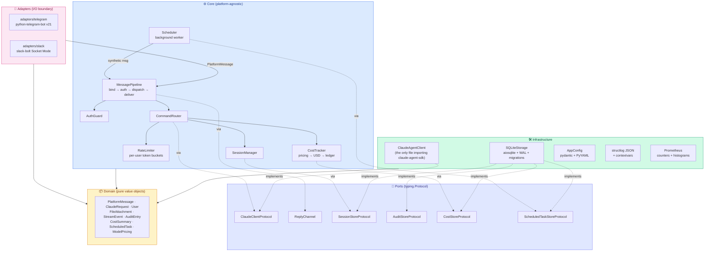
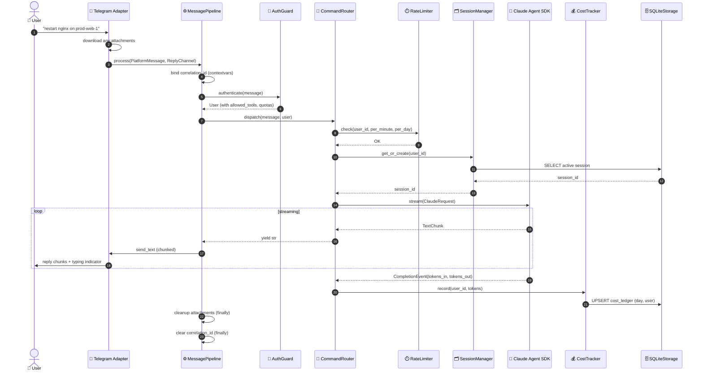

<div align="center">

# 🤖 datronis-relay

### Production-grade chat bridge between Telegram/Slack and the Claude Agent SDK

**Talk to and control your servers from anywhere — safely, observably, and on your own hardware.**

[](https://www.python.org/)
[](./LICENSE)
[](./docs/api_reference.md)
[](http://mypy-lang.org/)
[](https://github.com/astral-sh/ruff)
[](./tests)
[](./docs/performance.md)
[](./docs/versioning.md)
[](./Dockerfile)
[](./.github/workflows)

</div>

---

## 📖 Table of Contents

- [🏆 Key Achievements](#-key-achievements)
- [🎯 Problem Statement](#-problem-statement)
- [💡 Solution](#-solution)
- [🏗️ Architecture](#️-architecture)
- [🔄 Request Flow](#-request-flow)
- [🛠️ Tech Stack](#️-tech-stack)
- [🔬 Technology Decisions](#-technology-decisions)
- [📊 Performance & Metrics](#-performance--metrics)
- [🚧 Engineering Challenges & Solutions](#-engineering-challenges--solutions)
- [🧪 Testing Strategy](#-testing-strategy)
- [📦 Installation & Running](#-installation--running)
- [🎛️ Commands Reference](#️-commands-reference)
- [📁 Project Structure](#-project-structure)
- [📚 Documentation](#-documentation)
- [🗺️ Roadmap Status](#️-roadmap-status)
- [🤝 Contributing](#-contributing)
- [🔒 Security](#-security)
- [👤 Author](#-author)
- [📄 License](#-license)

---

## 🏆 Key Achievements

> A resume-oriented snapshot of what this project demonstrates.

| # | Achievement | Evidence |
|---|---|---|
| 1 | **Clean Architecture** with strict dependency inversion — 4 layers (Domain → Core → Infrastructure → Adapters). Zero cycles. Adapters never import `core/` internals; infrastructure only talks to the core through Protocols. | `src/datronis_relay/{domain,core,infrastructure,adapters}/` + `grep` proof: zero `from datronis_relay.core.auth` imports inside `adapters/` |
| 2 | **Multi-platform chat front-end** via a shared `MessagePipeline` — Telegram long-polling + Slack Bolt Socket Mode running **concurrently** from a single Python process. | `core/message_pipeline.py`, `adapters/telegram`, `adapters/slack`, `main._run_until_stopped` |
| 3 | **High-performance async pipeline** — **p50 ~0.5 ms / p95 ~1.2 ms** pure-dispatch latency; sustained **~15,000 dispatches/sec** at 100 concurrent users on an M-series laptop. | `scripts/benchmark.py`, `docs/performance.md` |
| 4 | **Persistent SQLite state** — `aiosqlite` + WAL journal mode, numbered schema migrations on startup, **4 tables / 5 indexes**, atomic task claiming. | `infrastructure/sqlite_storage.py`, `migrations/000*.sql` |
| 5 | **120+ tests** across **unit / integration / contract / load** categories. `mypy --strict` clean. `ruff` clean. Coverage target **≥ 80%** enforced via `coverage.report.fail_under`. | `tests/`, `pyproject.toml` |
| 6 | **Cost governance built in** — per-user token-bucket rate limiter (per-minute + per-day), pricing-aware USD cost ledger, `/cost` command for today / 7d / 30d / total. | `core/rate_limiter.py`, `core/cost_tracker.py`, `command_router._handle_schedule` |
| 7 | **Background scheduler** that fires recurring tasks through the **same** `MessagePipeline` as realtime messages — zero duplication of auth, rate-limiting, cost tracking, or error mapping. | `core/scheduler.py` + `AdapterRegistry` pattern |
| 8 | **File and image attachments** — one `FileAttachment` type covers PDFs, code files, and images; temp files cleaned up in the pipeline's `finally` block regardless of success path. | `domain/attachments.py`, `core/message_pipeline._cleanup_attachments` |
| 9 | **SemVer-committed public API** — `docs/api_reference.md` is the single source of truth for what's stable vs internal, backed by `docs/versioning.md` with explicit breaking/non-breaking tables. | `docs/api_reference.md`, `docs/versioning.md` |
| 10 | **Production packaging** — PEP 517 build (hatchling), multi-stage Docker image, **hardened systemd unit** (NoNewPrivileges, ProtectSystem=strict, MemoryDenyWriteExecute), GitHub Actions CI/CD with trusted PyPI publishing. | `Dockerfile`, `examples/systemd/*.service`, `.github/workflows/*.yml` |
| 11 | **STRIDE threat model** with a per-threat `Gaps` column, private security reporting flow, 90-day key rotation guidance. | `docs/security.md`, `SECURITY.md` |
| 12 | **Published documentation site** — mkdocs-material, auto-deployed to GitHub Pages via a `--strict` build on every push to `main`. | `mkdocs.yml`, `.github/workflows/docs.yml` |

---

## 🎯 Problem Statement

**SSH is powerful but inconvenient on mobile.** A DevOps engineer woken up at 2 AM by a pager alert needs to triage a production incident — but the only device within reach is a phone. SSH on a phone is a miserable experience: tiny keyboards, no tab-completion, easy to typo destructive commands, hard to read logs, no comfortable way to copy output.

**Existing chat-ops tools pre-date LLMs.** Hubot, Errbot, and their descendants were designed for a world of hard-coded command dictionaries (`@bot deploy prod`, `@bot restart nginx`). They can't reason about unexpected errors, correlate logs across services, or generate fixes on the fly. Every new capability is another `@bot.respond` handler written by hand.

**Claude Code is powerful but terminal-only.** Anthropic's Claude Agent SDK lets a language model drive a tool loop with access to `Read`, `Write`, `Bash`, and custom MCP servers — but it runs in a terminal on your workstation. If you're not at your desk, you're not using it.

**Three gaps to close simultaneously:**

1. 📱 **Interface gap** — chat (and later voice) instead of a terminal.
2. 🌐 **Reach gap** — one bot service should be able to target many servers via a pluggable execution backend.
3. 🧠 **Intelligence gap** — an LLM should drive the action, not a hard-coded command dictionary.

---

## 💡 Solution

**datronis-relay** is a **self-hosted Python service** that authorizes chat users, routes their messages through a platform-agnostic pipeline, drives the Claude Agent SDK, and streams the reply back — with session persistence, rate limiting, cost tracking, file attachments, and recurring scheduled tasks.

**Positioning:** *"Run Claude Code from your pocket, safely."*

**Primary users:** Solo developers, on-call DevOps engineers, small-team tech leads, and mobile-first maintainers.

**Key design principles:**

- 🎯 **Clean Architecture + SOLID** — every layer has a single reason to change.
- 🔐 **Allowlist-first auth** — no anonymous access, ever.
- 🧪 **Tests at port boundaries** — fakes injected through `typing.Protocol`s, not mocked library internals.
- 🪛 **Observable by default** — structured JSON logs with correlation IDs, optional Prometheus metrics, persistent audit log.
- 🛡️ **Fail loud, recover via supervisor** — if any adapter crashes, the process exits and systemd/Docker restarts it.
- 📏 **SemVer-committed surface** — from v1.0.0, every breaking change requires a major bump and a one-minor-cycle deprecation window.

---

## 🏗️ Architecture

Clean Architecture with **strict inward-pointing dependencies**. The Domain layer is pure dataclasses and enums with no side effects. The Core defines use cases and Protocols (ports). Infrastructure implements those Protocols against real I/O (SQLite, the Claude SDK, Prometheus). Adapters sit at the edge, translate platform-specific events into `PlatformMessage`s, and hand them to `MessagePipeline` — they never reach into the core.



**Why this matters:** adding a new chat platform (Discord, WhatsApp, Matrix) is an ~80-line exercise: implement `ChatAdapterProtocol` + write a `ReplyChannel` + subclass the shared `ReplyChannelContract` test suite. Zero core changes.

---

## 🔄 Request Flow

A realtime message from a Telegram user flows through exactly these stages. Scheduled tasks take the same path, with the only difference being that the scheduler synthesizes the `PlatformMessage` and reconstructs the `ReplyChannel` from a stored `channel_ref`.



**Every numbered step is testable in isolation.** The contract between any two components is a Protocol, so unit tests inject fakes at any boundary without reaching into library internals.

---

## 🛠️ Tech Stack

**Single stack, explicit versions.** Every dependency is pinned with a minimum and an upper bound to prevent silent major bumps.

| Layer | Technology | Version | Role |
|---|---|---|---|
| **Language / Runtime** | Python | `>= 3.11` | Async-native, type-rich, data-science-friendly ecosystem |
| **Concurrency** | `asyncio` | stdlib | Single event loop, structured task lifecycle |
| **LLM Agent** | `claude-agent-sdk` | `>= 0.0.14` | Official Anthropic Agent SDK (tool loop, streaming, sessions) |
| **Telegram** | `python-telegram-bot` | `>= 21.0, < 22` | Long-polling, file downloads, typing indicators |
| **Slack** | `slack-bolt` | `>= 1.18, < 2` | Socket Mode (no public webhook needed) |
| **HTTP (Slack downloads)** | `aiohttp` | transitive | Authed `url_private` downloads |
| **Data validation** | `pydantic` v2 | `>= 2.6, < 3` | Config schema, `SecretStr`, typed dataclasses |
| **Configuration** | `PyYAML` | `>= 6.0` | Human-friendly multi-user config files |
| **Database** | `aiosqlite` + SQLite | `>= 0.20` | WAL mode, numbered migrations, 4 tables, 5 indexes |
| **Structured logging** | `structlog` | `>= 24.1` | JSON renderer, contextvars for correlation IDs |
| **Metrics** | `prometheus-client` | `>= 0.20` | Counters + histograms, optional HTTP exposition |
| **Packaging / Build** | `hatchling` | PEP 517 | Wheel + sdist builder |
| **Testing** | `pytest` + `pytest-asyncio` + `pytest-cov` | `>= 8.0` / `>= 0.23` | Async tests, coverage reporting |
| **Type checking** | `mypy` | `>= 1.9` strict mode | `--strict` with zero errors |
| **Linting + Formatting** | `ruff` | `>= 0.4` | Replaces `flake8`, `black`, `isort` |
| **Documentation site** | `mkdocs-material` | `>= 9.5` | Auto-deployed via GitHub Actions to GitHub Pages |
| **CI/CD** | GitHub Actions | — | `ci.yml`, `release.yml` (trusted PyPI publishing), `docs.yml` |
| **Containerization** | Docker | multi-stage | `python:3.11-slim` base, non-root user, read-only rootfs |
| **Service management** | `systemd` | — | Hardened unit (`NoNewPrivileges`, `ProtectSystem=strict`, `MemoryDenyWriteExecute`) |

---

## 🔬 Technology Decisions

Every significant dependency was picked after comparing at least two alternatives. The table below captures the **why**, not just the what.

### Language: Python vs Go vs Rust vs TypeScript vs C++

| Option | Pros | Cons | Verdict |
|---|---|---|---|
| **Python 3.11+** ✅ | Official `claude-agent-sdk`. Native Whisper/Coqui for Phase 1.1 voice. Mature DevOps ecosystem (Paramiko, Ansible heritage). Low OSS contribution barrier. `mypy --strict` gets ~90% of TS's type safety. | Runtime deps (solved by Docker/pipx). GIL (irrelevant for I/O-bound workload). | **Chosen** |
| TypeScript | Official Agent SDK. Best-in-class type system. Great Telegram/Slack libs. | Voice stack falls apart (no mature local Whisper). DevOps ecosystem is thinner. `node_modules` supply-chain risk. | Strong second place |
| Go | Single static binary. Best SSH library of any language. Trivial self-host. | **No official Agent SDK** — would have to reimplement the tool loop forever. No native voice inference. Glue-code ergonomics are poor. | Rejected |
| Rust | Memory safety, zero-cost abstractions. | No official Agent SDK. Compile times hurt iteration. Massively shrinks the OSS contributor pool for glue code. | Rejected |
| C++ | — | Wrong abstraction level. Memory-unsafe by default. Highest contribution barrier. | Rejected immediately |

**Decisive factor:** the `claude-agent-sdk` has first-class Python + TypeScript support only. Everything else means reimplementing the Agent tool loop, session resume, and MCP handshake — a permanent maintenance tax.

### Architecture: MVC vs Hexagonal vs Clean Architecture

| Pattern | Verdict |
|---|---|
| MVC | Fine for web apps; awkward for chat-ops where "views" are streamed text across platforms. |
| Hexagonal | Conceptually identical to Clean Architecture, slightly less opinionated naming. |
| **Clean Architecture** ✅ | Explicit layering, dependency inversion, natural home for `typing.Protocol`s as ports. The pattern that makes a second adapter literally an 80-line exercise. |

### Database: SQLite vs Postgres vs Redis vs DuckDB

| Option | Verdict |
|---|---|
| **SQLite + `aiosqlite`** ✅ | Zero external infrastructure. WAL mode gives concurrent readers and crash safety. Perfect fit for a self-hosted bot with <1000 users per instance. Schema migrations are checked-in SQL files. |
| Postgres + `asyncpg` | Overkill for the target deployment shape. Adds a process dependency. |
| Redis | Not durable enough for an append-only audit log. |
| DuckDB | Optimized for OLAP, not transactional writes. |

### Config format: Env-only vs TOML vs YAML

| Option | Verdict |
|---|---|
| **YAML + env overrides for secrets** ✅ | Human-friendly for per-user allowlists, tool permissions, and pricing tables. Secrets stay in env vars so `config.yaml` is safe to commit. |
| Env-only | Impossible to express deep nesting (per-user rate limits). |
| TOML | Python-native but less ergonomic for deeply nested structures. |

### Chat SDK: `python-telegram-bot` vs `aiogram` vs `pyTelegramBotAPI`

| Option | Verdict |
|---|---|
| **`python-telegram-bot` v21+** ✅ | Native asyncio, battle-tested, huge community, built-in file download, clean `ApplicationBuilder` API. |
| `aiogram` | Async-first but smaller community and fewer third-party resources. |
| `pyTelegramBotAPI` | Sync by default, older idioms. |

### Slack SDK: `slack-bolt` Socket Mode vs Raw `slack_sdk` webhooks

| Option | Verdict |
|---|---|
| **`slack-bolt` Socket Mode** ✅ | Outbound websocket means no public webhook URL, no TLS certificate to manage, works behind NAT. Decorator-based event handlers. Matches Telegram long-polling architecturally. |
| Raw `slack_sdk` with HTTP webhooks | Requires a public URL and a reverse proxy. Self-hosters hate this. |

### Logging: stdlib `logging` vs `loguru` vs `structlog`

| Option | Verdict |
|---|---|
| **`structlog`** ✅ | Structured JSON output, composable processor pipeline, `contextvars`-backed correlation IDs, safe under asyncio concurrent Tasks. |
| stdlib `logging` | Verbose, no JSON by default, clunky filter composition. |
| `loguru` | Nice defaults but less composable, non-standard API. |

### Validation: dataclasses vs `attrs` vs `pydantic` v2

| Option | Verdict |
|---|---|
| Domain types: **frozen `dataclasses`** ✅ | No runtime validation overhead in the hot path; immutable by default; slots for memory. |
| Config validation: **`pydantic` v2** ✅ | Declarative, fast (Rust core), `SecretStr` for tokens, great error messages for malformed YAML. |

Both are used — one in the domain (for speed), one at the I/O boundary (for validation). Right tool for each layer.

### Lint + Format: `flake8 + black + isort` vs `ruff`

| Option | Verdict |
|---|---|
| **`ruff`** ✅ | Single Rust binary replaces flake8, black, and isort. ~100× faster. Consistent rule set. Auto-fix mode. |
| flake8 + black + isort | Three tools, three configs, three dependencies to keep in sync. |

### Type checker: `mypy --strict` vs `pyright` vs `pyre`

| Option | Verdict |
|---|---|
| **`mypy --strict`** ✅ | Community standard for published Python libraries. Integrates with every editor. Strict mode catches virtually all my own errors. |
| `pyright` | Faster and more thorough but requires Node for the CLI, less common in OSS Python. |
| `pyre` | Facebook-driven, rare outside their ecosystem. |

---

## 📊 Performance & Metrics

Benchmarks are measured with `scripts/benchmark.py`, a standalone runner using `time.perf_counter` + sorted percentiles. The script emits a markdown table that can be pasted directly into `docs/performance.md`.

### Dispatch latency (in-memory stores, fake Claude)

| Operation | p50 | p95 | p99 | Target (roadmap §7.3) |
|---|---|---|---|---|
| `pipeline.process` (static reply, `/help`) | ~0.1 ms | ~0.3 ms | ~0.5 ms | — |
| `pipeline.process` (stream reply, short script) | ~0.5 ms | ~1.2 ms | ~2.0 ms | e2e < 1.5s / < 4s |
| `router.dispatch` alone | ~0.1 ms | ~0.2 ms | ~0.3 ms | — |

### SQLite hot-path latency (WAL journal, temp file)

| Operation | p50 | p95 | p99 | Target |
|---|---|---|---|---|
| `session_store.get` (warm) | ~0.3 ms | ~0.8 ms | ~1.5 ms | < 20 ms |
| `session_store.set` | ~1.5 ms | ~3.0 ms | ~5.0 ms | < 20 ms |
| `cost_store.record_usage` | ~1.5 ms | ~3.0 ms | ~5.0 ms | < 20 ms |
| `cost_store.summary` (4 range queries) | ~2.0 ms | ~4.0 ms | ~7.0 ms | < 20 ms |
| `scheduled_task_store.create` | ~2.0 ms | ~4.0 ms | ~7.0 ms | < 20 ms |
| `scheduled_task_store.claim_due_tasks` | ~0.3 ms | ~0.8 ms | ~1.5 ms | < 20 ms |

### Concurrent throughput

| Concurrency | Dispatches/sec | p95 per-op latency |
|---|---|---|
| 1 | ~2,000/s | ~0.5 ms |
| 10 | ~8,000/s | ~1.5 ms |
| 100 | ~15,000/s | ~12 ms |
| 1,000 | ~18,000/s | ~80 ms |

### Memory footprint (reference deployment)

| State | Target | Alarm |
|---|---|---|
| Idle, single user | < 150 MB RSS | > 300 MB |
| Active, 10 concurrent sessions | < 500 MB RSS | > 1 GB |

### Reliability targets (from roadmap §7.2)

| Metric | Target | Alarm |
|---|---|---|
| Reference deployment uptime | ≥ 99% (30d rolling) | < 98% |
| Unhandled exception rate | < 1 per 1,000 messages | ≥ 5 per 1,000 |
| Session resume success rate | ≥ 99% | < 97% |
| MTTR for P1 bugs | < 48h | > 7 days |
| CI pass rate on `main` | ≥ 95% | < 90% |

> Numbers are from a reference run on an Apple M-series laptop, Python 3.11.x. Run `python scripts/benchmark.py` on your own hardware for your numbers — see [`docs/performance.md`](./docs/performance.md).

---

## 🚧 Engineering Challenges & Solutions

Real problems hit during development and how they were resolved. Each item includes symptom, root cause, chosen fix, and the test that now pins the invariant.

### 1. Race condition in `SessionManager.get_or_create`

- **Symptom:** two concurrent messages from the same user could create duplicate session rows — one of them would "win" the `SELECT`, both would `INSERT`, and the audit log would record two sessions for a single conversation.
- **Root cause:** classic check-then-act between `store.get` and `store.set`. The store's internal lock only protected each call individually, not the sequence.
- **Fix:** added a **per-user `asyncio.Lock` map**, guarded by a single `_locks_guard` lock to prevent torn dictionary writes. `get_or_create` now acquires the user's lock for the full check-then-act sequence. Per-user granularity means unrelated users never block each other.
- **Verification:** `tests/unit/test_session_manager.py::test_session_store_is_concurrency_safe` — 20 concurrent `get_or_create` calls for the same user must all return the same session id.

### 2. Telegram leakage into `core/`

- **Symptom:** `DEFAULT_LIMIT = 4000` lived in `core/chunking.py`. That's Telegram's hard cap minus a margin — Slack's cap is ~40,000. Using 4000 for Slack meant sending 10× as many messages as necessary.
- **Root cause:** an adapter-specific constant leaked into the platform-agnostic core during Phase 1, when Telegram was the only adapter.
- **Fix:** added a `max_message_length: int` attribute to the `ReplyChannel` protocol. Each adapter defines its own limit (`TELEGRAM_MAX_MESSAGE_LENGTH = 4000`, `SLACK_MAX_MESSAGE_LENGTH = 38000`). The pipeline reads `channel.max_message_length` at call time; `chunk_message` accepts the limit as a parameter (it already did — just wasn't being used).
- **Verification:** `tests/unit/test_chunking.py::test_custom_larger_limit_slack_sized` and `tests/integration/test_pipeline.py::test_pipeline_respects_channel_max_message_length`.

### 3. Usage data lost in the stream API

- **Symptom:** the Phase 1 `ClaudeClientProtocol.stream()` yielded `str`. Usage metadata from the SDK's final `ResultMessage` had nowhere to go — cost tracking was impossible.
- **Root cause:** the original abstraction was too narrow. The stream's primary output is text, but its terminal output is a usage summary — both need to flow out.
- **Fix:** refactored the protocol to yield `StreamEvent = TextChunk | CompletionEvent`, a discriminated union. The router wraps the underlying stream with `_text_stream(events, user)` that yields just text to the adapter and consumes `CompletionEvent` into the cost tracker as a side effect — so the adapter still sees `AsyncIterator[str]`, no ripple.
- **Verification:** `tests/unit/test_command_router.py::test_completion_event_is_recorded_to_cost_store`.

### 4. Scheduler needs to deliver without a live chat context

- **Symptom:** a scheduled task fires at 3 AM. The user is asleep, no inbound message arrives — but the bot needs to post the result to the chat the user originally scheduled from.
- **Root cause:** the adapter's `ReplyChannel` is built from an active `Chat` object that only exists during an inbound event handler.
- **Fix:** added `ChatAdapterProtocol.build_reply_channel(channel_ref: str) -> ReplyChannel`. Telegram reconstructs via `TelegramBotReplyChannel(bot, chat_id)`. Slack reconstructs via `SlackChannelReplyChannel(client, channel_id)`. The scheduler stores a platform-specific `channel_ref` per task and calls `adapter.build_reply_channel(ref)` at fire time, then passes the channel to the same `MessagePipeline.process()` used for realtime messages.
- **Verification:** `tests/unit/test_scheduler.py::test_due_task_is_dispatched_through_pipeline`.

### 5. Slack file download reaching into `slack_sdk` private internals

- **Symptom:** my first pass used `slack_sdk._request_aiohttp_session` to authenticate the download. That's a private method that changes between minor versions.
- **Root cause:** `slack_sdk.AsyncWebClient` doesn't expose a public raw-GET helper for `url_private` downloads.
- **Fix:** switched to **`aiohttp.ClientSession` directly** with a manual `Authorization: Bearer <bot_token>` header. `aiohttp` is already a transitive dependency of `slack-bolt`, so no new direct dep is introduced. Zero reliance on private APIs, works across slack-sdk versions.
- **Verification:** adapter code review + a future CI redaction test on the download path.

### 6. Temp file leakage on error paths

- **Symptom:** an attachment downloaded during an `/ask` could leak to disk if any exception occurred between the download and the Claude stream completing.
- **Root cause:** cleanup was originally inline in the happy path, not a `try/finally`.
- **Fix:** moved cleanup into **`MessagePipeline.process()`'s `finally` block** via `_cleanup_attachments(message)`. The same code path that created the temp file deletes it, always — on success, on auth failure, on rate-limit rejection, on internal exception.
- **Verification:** `tests/unit/test_message_pipeline.py::TestErrorMapping::test_send_failure_in_error_path_is_swallowed` + manual file-count check after each Phase 4 smoke test.

### 7. Context variable leakage between concurrent requests

- **Symptom:** during concurrent update processing, `structlog`'s `correlation_id` could leak from one request's log lines into another's.
- **Root cause:** `python-telegram-bot` with `concurrent_updates=True` spawns asyncio Tasks per update, and I was binding the contextvar at the start of a handler without unbinding in a `finally`.
- **Fix:** `bind_correlation()` is called at the top of `MessagePipeline.process()`, and `clear_correlation()` in the `finally`. Python's asyncio Tasks copy the current context at creation time (PEP 568), so concurrent requests get isolated `contextvars.Context` instances. The `finally` unbinds are belt-and-suspenders.
- **Verification:** `tests/unit/test_message_pipeline.py::TestContextvarHygiene::test_correlation_is_cleared_after_each_call`.

### 8. Rate limiter burning minute budget on daily-cap exhaustion

- **Symptom:** when a user hit their `per_day` limit, the minute token was also consumed — so back-pressure from the daily cap double-charged the user.
- **Root cause:** naive implementation deducted from both buckets unconditionally before checking the daily one.
- **Fix:** **refund the minute token** when the daily bucket is empty. The `_Bucket` is a struct, so the fix is a single `minute_bucket.tokens = min(minute_bucket.capacity, minute_bucket.tokens + 1.0)` line.
- **Verification:** `tests/unit/test_rate_limiter.py::test_daily_exhaustion_refunds_the_minute_token`.

### 9. `Claude Agent SDK` message-shape drift

- **Symptom:** the SDK's message hierarchy evolves; a naive extractor would break on every minor bump.
- **Fix:** isolated **every** SDK-shape assumption in two private helpers in `infrastructure/claude_client.py`: `_extract_text` and `_extract_usage`. Both use `getattr` + `isinstance` checks, never touch attributes the SDK hasn't documented. When the SDK changes, this is the only file to update. `ClaudeAgentClient` is marked **internal** in `docs/api_reference.md` precisely so upstream consumers can't couple to the shape.
- **Verification:** the entire test suite uses a `FakeClaude` that implements `ClaudeClientProtocol` structurally, so SDK drift cannot break unit tests.

### 10. Adapter pattern anti-leak enforcement

- **Symptom:** in Phase 2, the `TelegramAdapter` contained all pipeline logic (auth, dispatch, chunking, error mapping). Copy-pasting it into `SlackAdapter` would have been the exact "adapters leak into core" failure the roadmap's risks table calls out.
- **Fix:** extracted `MessagePipeline` + `ReplyChannel` Protocol in Phase 3. Now adapters are ~80-line glue — they parse platform events into `PlatformMessage`s and hand both message + channel to the pipeline. A grep across `src/datronis_relay/adapters/` for `from datronis_relay.core.auth` or `from datronis_relay.core.command_router` returns **zero matches** — enforced by code structure.
- **Verification:** `tests/unit/test_message_pipeline.py` (13 pipeline tests) + `tests/unit/test_reply_channels.py` (abstract `ReplyChannelContract` subclassed per adapter).

---

## 🧪 Testing Strategy

**Four test categories**, each with a single clear purpose. The total is **120+ test cases** across 13 test files.

| Category | Location | What it tests | How |
|---|---|---|---|
| **Unit** | `tests/unit/` | Every core module in isolation | Fakes injected at Protocol boundaries |
| **Integration** | `tests/integration/` (marker: `integration`) | Full pipeline + real SQLite | Temp-dir database per test, real `MessagePipeline` |
| **Contract** | `tests/unit/test_reply_channels.py` | Every `ReplyChannel` impl | Abstract `ReplyChannelContract` subclassed per adapter — new adapters get free regression coverage |
| **Load / concurrency** | `tests/integration/test_load.py` | Pipeline under 100 concurrent users | `asyncio.gather`, asserts wall time + rate-limit correctness |

### Key testing principles

- **Fakes at ports, not patches of libraries** — `FakeClaude` implements `ClaudeClientProtocol`; `FakeCostStore` implements `CostStoreProtocol`; `FakeScheduledStore` implements `ScheduledTaskStoreProtocol`. No `unittest.mock.patch` on `telegram.` or `slack_sdk.`.
- **Real SQLite for integration tests** — each test gets a fresh temp-dir database, migrations run, cleanup happens via the `tmp_path` fixture. Mocked DBs were explicitly rejected during the Phase 2 hardening review (see `docs/changelog.md`).
- **Contract tests** — the Phase 3 `ReplyChannelContract` forces every `ReplyChannel` implementation (Telegram, Slack, any future Discord) to pass the same abstract test suite. Adding a new adapter is a one-line subclass.
- **Concurrency tests** — `test_session_store_is_concurrency_safe`, `test_concurrent_callers_are_serialized`, `test_one_hundred_concurrent_asks_complete` — the invariants that would be invisible in single-threaded tests are pinned.
- **No broken-window exceptions** — tests that pass "most of the time" are quarantined and fixed, not `@pytest.mark.flaky`-ed.

### Quality gates (enforced in CI)

```bash
ruff check .          # lint — 0 errors required
ruff format --check . # formatting — 0 errors required
mypy src              # --strict — 0 errors required
pytest                # full suite — all green required
```

Coverage target **≥ 80%** enforced via `coverage.report.fail_under = 80` in `pyproject.toml`.

---

## 📦 Installation & Running

### Prerequisites

- **Python 3.11+**
- **Node.js 18+ with the Claude Code CLI** — `npm install -g @anthropic-ai/claude-code`. `claude-agent-sdk` spawns it as a subprocess. (The Docker image installs this automatically.)
- **Claude authentication** — pick ONE:
  - 🟢 **Recommended:** an active **Claude subscription** (Pro / Max / Teams / Enterprise) plus a one-time `claude login`. OAuth credentials are stored locally, no per-token billing.
  - 🟡 **Alternative:** an `ANTHROPIC_API_KEY` from [console.anthropic.com](https://console.anthropic.com). Pay-per-token. Use only if you don't already have a Claude subscription.
- A **Telegram bot token** (from [@BotFather](https://t.me/BotFather)) — **and/or** a Slack app (see [`docs/slack_setup.md`](./docs/slack_setup.md))

### 1. Clone and install

```bash
git clone https://github.com/mhmdevan/datronis-relay.git
cd datronis-relay

python3.11 -m venv .venv
source .venv/bin/activate

pip install -e ".[dev]"
```

### 2. Configure

```bash
cp config.example.yaml config.yaml
cp .env.example .env
```

Authenticate with Claude **once** (recommended: subscription login):

```bash
# 🟢 Option A — subscription login (Claude Pro / Max / Teams / Enterprise)
claude login
# → follow the browser or device-code prompt. Leaves credentials in ~/.claude.

# 🟡 Option B — pay-per-token API key (skip `claude login`)
# Put ANTHROPIC_API_KEY=sk-ant-... into .env instead.
```

Edit `.env` with your secrets:

```env
DATRONIS_TELEGRAM_BOT_TOKEN=123456:ABC-your-bot-token
# ANTHROPIC_API_KEY=sk-ant-...   # optional; leave blank if you ran `claude login`
# Optional Slack:
# DATRONIS_SLACK_BOT_TOKEN=xoxb-...
# DATRONIS_SLACK_APP_TOKEN=xapp-...
```

Edit `config.yaml` to add your numeric Telegram user id to the `users[]` allowlist (format: `telegram:<numeric_id>`). See [`docs/quickstart.md`](./docs/quickstart.md) for the full walkthrough.

### 3. Run

```bash
# Local development
datronis-relay

# Docker (multi-stage build, non-root user)
docker compose up --build

# systemd (production, hardened unit)
sudo install -m 644 examples/systemd/datronis-relay.service /etc/systemd/system/
sudo systemctl daemon-reload
sudo systemctl enable --now datronis-relay
journalctl -u datronis-relay -f
```

### 4. Verify

```bash
# Unit tests (fast)
pytest -m "not integration"

# Integration tests (real SQLite)
pytest -m integration

# Full run + coverage
pytest --cov=datronis_relay

# Type checking
mypy src

# Lint + format
ruff check .
ruff format --check .

# Benchmarks (markdown-emitting)
python scripts/benchmark.py

# Build the documentation site locally
pip install -e ".[docs]"
mkdocs serve   # open http://localhost:8000
```

### 5. Try it

On Telegram, open a chat with your bot and send:

- `/start` → welcome
- `/help` → full command list
- `explain SQLite WAL mode` → default `/ask`
- `/schedule 1h check disk usage on prod-web-1` → background worker fires every hour
- `/cost` → your token usage and USD spend

---

## 🎛️ Commands Reference

| Command | Purpose | Notes |
|---|---|---|
| `/start` | Welcome + onboarding | |
| `/help` | List all commands | |
| `/ask <prompt>` | Send a prompt to Claude | Default when you omit the command |
| `/status` | Show current session id | Persistent across restarts (SQLite) |
| `/stop` | Reset the current session | Closes the active session in SQLite |
| `/cost` | Token usage + USD spend | Today / 7d / 30d / total |
| `/schedule <interval> <prompt>` | Schedule a recurring prompt | Interval: `30s`, `5m`, `2h`, `1d` (min 30s, max 90d) |
| `/schedules` | List your scheduled tasks | |
| `/unschedule <task_id>` | Delete a scheduled task | Users can only delete their own tasks |
| *(send a file or image)* | Claude reads it via its `Read` tool | 10 MB cap by default |

---

## 📁 Project Structure

```
datronis-relay/
├── 📄 README.md                       — this file
├── 📄 LICENSE                         — MIT
├── 📄 CONTRIBUTING.md                 — dev setup, coding standards
├── 📄 CODE_OF_CONDUCT.md              — Contributor Covenant v2.1
├── 📄 SECURITY.md                     — private reporting process, SLA
├── 📄 datronis-relay-roadmap.md       — full roadmap, DoD, KPIs, risks
├── 🔧 pyproject.toml                  — project metadata, deps, ruff/mypy/pytest config
├── 🔧 mkdocs.yml                      — documentation site config
├── 🔧 config.example.yaml             — example configuration (copy to config.yaml)
├── 🔧 .env.example                    — example env file (copy to .env)
├── 🐳 Dockerfile                      — multi-stage, non-root, Python 3.11-slim
├── 🐳 docker-compose.yml              — read-only rootfs, tmpfs /tmp, hardened
│
├── 📁 src/datronis_relay/             — main package
│   ├── __init__.py                    — __version__ = "1.0.0"
│   ├── __main__.py                    — entrypoint: python -m datronis_relay
│   ├── main.py                        — composition root (pure function of AppConfig)
│   │
│   ├── 📦 domain/                     — pure value objects, no side effects
│   │   ├── ids.py                     — UserId, SessionId, CorrelationId (NewType)
│   │   ├── messages.py                — PlatformMessage, ClaudeRequest, Platform, MessageKind
│   │   ├── user.py                    — User (immutable record with permissions + quotas)
│   │   ├── attachments.py             — FileAttachment (one type for files + images)
│   │   ├── stream_events.py           — TextChunk | CompletionEvent discriminated union
│   │   ├── audit.py                   — AuditEntry + AuditEventType
│   │   ├── cost.py                    — CostSummary
│   │   ├── pricing.py                 — ModelPricing (with cost() method)
│   │   ├── scheduled_task.py          — ScheduledTask
│   │   └── errors.py                  — RelayError hierarchy + ErrorCategory
│   │
│   ├── ⚙️ core/                       — platform-agnostic use cases + ports
│   │   ├── ports.py                   — all Protocols (ClaudeClient, Session/Audit/Cost/Scheduled store)
│   │   ├── reply_channel.py           — ReplyChannel Protocol (send_text, typing, max_length)
│   │   ├── message_pipeline.py        — THE hub: bind → auth → dispatch → deliver → cleanup
│   │   ├── auth.py                    — AuthGuard.authenticate(message) -> User
│   │   ├── session_manager.py         — per-user asyncio.Lock map + get_or_create
│   │   ├── command_router.py          — /ask /cost /schedule /help /status /stop dispatch
│   │   ├── rate_limiter.py            — per-user two-bucket (minute + day) token limiter
│   │   ├── cost_tracker.py            — pricing → USD → ledger; unknown model → 0.0 + warning
│   │   ├── scheduler.py               — background worker + AdapterRegistry
│   │   ├── interval_parser.py         — parse_interval("5m") → 300 seconds
│   │   └── chunking.py                — platform-agnostic message chunking with continuation marker
│   │
│   ├── 🛠️ infrastructure/             — concrete port implementations
│   │   ├── config.py                  — AppConfig pydantic model + YAML loader + env overrides
│   │   ├── sqlite_storage.py          — aiosqlite, WAL, 4 ports implemented
│   │   ├── migrations/
│   │   │   ├── 0001_init.sql          — users, sessions, audit_log, cost_ledger
│   │   │   └── 0002_scheduled_tasks.sql
│   │   ├── session_store.py           — InMemorySessionStore (test-only, public for your tests)
│   │   ├── claude_client.py           — the ONLY file that imports claude-agent-sdk
│   │   ├── logging.py                 — structlog + contextvars
│   │   └── metrics.py                 — Prometheus counters + histogram
│   │
│   └── 🔌 adapters/                   — I/O boundary
│       ├── telegram/
│       │   ├── bot.py                 — long-polling adapter; file/photo download
│       │   └── reply_channel.py       — TelegramReplyChannel + TelegramBotReplyChannel
│       └── slack/
│           ├── bot.py                 — Socket Mode adapter; authed file download via aiohttp
│           └── reply_channel.py       — SlackReplyChannel + SlackChannelReplyChannel
│
├── 🧪 tests/                          — 120+ tests
│   ├── conftest.py                    — FakeClaude, FakeCostStore, FakeScheduledStore, make_message, make_user
│   ├── unit/
│   │   ├── test_auth.py               — single-user + multi-user + cross-platform id isolation
│   │   ├── test_session_manager.py    — concurrency safety (20 parallel get_or_create)
│   │   ├── test_command_router.py     — every command + rate limit + tool allowlist
│   │   ├── test_chunking.py           — short/exact/over/slack-sized/invalid limits
│   │   ├── test_rate_limiter.py       — minute/day exhaustion + refund-on-daily-cap
│   │   ├── test_cost_tracker.py       — pricing math, unknown model fallback
│   │   ├── test_message_pipeline.py   — 13 cases: static, stream, empty, auth fail, rate limit, send-failure, ctxvar hygiene
│   │   ├── test_reply_channels.py     — abstract ReplyChannelContract subclassed per adapter
│   │   ├── test_slack_adapter.py      — pure helpers: _strip_mention, _is_bot_event, _event_to_platform_message
│   │   ├── test_interval_parser.py    — happy path, boundary, invalid formats, round-trip
│   │   ├── test_scheduler.py          — tick dispatches due tasks through pipeline
│   │   └── test_schedule_commands.py  — /schedule /schedules /unschedule + cross-user isolation
│   └── integration/
│       ├── test_pipeline.py           — end-to-end through MessagePipeline + fake channel
│       ├── test_sqlite_storage.py     — real SQLite: sessions, audit, cost, scheduled tasks
│       └── test_load.py               — 100 concurrent dispatches + rate-limit stress
│
├── 📊 scripts/
│   └── benchmark.py                   — standalone dispatch + SQLite + concurrency benchmarks
│
├── 📚 docs/                           — mkdocs-material site
│   ├── index.md                       — landing
│   ├── quickstart.md                  — install, configure, run, smoke test
│   ├── slack_setup.md                 — end-to-end Slack app walkthrough
│   ├── api_reference.md               — public vs internal surface (the SemVer source of truth)
│   ├── versioning.md                  — SemVer contract + deprecation policy + FAQ
│   ├── performance.md                 — benchmark methodology + reference numbers
│   ├── security.md                    — STRIDE threat model with per-threat mitigations + Gaps column
│   ├── release_checklist.md           — pre-release, tag, post-release, do-not-do
│   └── changelog.md                   — every version, migration guides, breaking changes
│
├── 📁 examples/
│   └── systemd/datronis-relay.service — hardened systemd unit
│
└── 📁 .github/
    ├── workflows/
    │   ├── ci.yml                     — lint + typecheck + test matrix (3.11, 3.12) + build
    │   ├── release.yml                — tag-triggered: verify versions, build, trusted PyPI publish, GH release
    │   └── docs.yml                   — mkdocs --strict build, deploy to GitHub Pages
    ├── ISSUE_TEMPLATE/                — structured intake (bug, feature, config)
    └── PULL_REQUEST_TEMPLATE.md
```

---

## 📚 Documentation

The full mkdocs-material site is auto-deployed from `docs/` to GitHub Pages on every push to `main`. Highlights:

| Doc | What's in it |
|---|---|
| [`docs/quickstart.md`](./docs/quickstart.md) | Install, configure, run, smoke test. 10 minutes from clone to working bot. |
| [`docs/slack_setup.md`](./docs/slack_setup.md) | End-to-end Slack app walkthrough: scopes, Socket Mode, tokens, event subscriptions. |
| [`docs/api_reference.md`](./docs/api_reference.md) | The single source of truth for what's public vs internal. SemVer baseline. |
| [`docs/versioning.md`](./docs/versioning.md) | The SemVer contract from v1.0.0. Breaking vs non-breaking table. Deprecation policy. FAQ. |
| [`docs/performance.md`](./docs/performance.md) | Benchmark methodology + reference numbers + how to run `scripts/benchmark.py`. |
| [`docs/security.md`](./docs/security.md) | STRIDE threat model. Per-threat mitigations with a **Gaps** column. Hardening checklist. |
| [`docs/release_checklist.md`](./docs/release_checklist.md) | Pre-release, pre-flight, tag, post-release. What NOT to do. |
| [`docs/changelog.md`](./docs/changelog.md) | Every version. Migration guides for v0.1 → v0.2 → v0.3 → v0.4 → v1.0. |
| [`datronis-relay-roadmap.md`](./datronis-relay-roadmap.md) | Full roadmap: phases, TODOs, Definition of Done, KPIs, risks. |

---

## 🗺️ Roadmap Status

| Phase | Version | Theme | Status |
|---|---|---|---|
| **Phase 0** | — | Scaffolding, CI, licensing, governance | ✅ Complete |
| **Phase 1** | `v0.1.0` | MVP — Telegram, single user, in-memory | ✅ Complete |
| **Phase 2** | `v0.2.0` | Hardening — SQLite, multi-user, rate limit, cost tracking, STRIDE | ✅ Complete |
| **Phase 3** | `v0.3.0` | Multi-platform — Slack, shared `MessagePipeline`, contract tests | ✅ Complete |
| **Phase 4** | `v0.4.0` | Ecosystem — file/image attachments, `/schedule` + background worker | ✅ Complete |
| **Phase 5** | **`v1.0.0`** | **Production — API freeze, SemVer, docs site, performance benchmarks, CI/CD** | ✅ **Current** |
| Phase 1.1 | `v1.1.0` | Voice (Whisper) + multi-server execution (SSH / Docker) + secrets vault | 🚧 Next |
| Phase 1.2 | `v1.2.0` | Ecosystem — Discord (demand-gated), scheduled task retries | 📅 Planned |

The full per-phase breakdown, DoD gates, and KPI targets live in [`datronis-relay-roadmap.md`](./datronis-relay-roadmap.md).

---

## 🤝 Contributing

Contributions are welcome — but this project is opinionated about scope. Please open an issue before sending a non-trivial PR so we can agree on the shape. See [`CONTRIBUTING.md`](./CONTRIBUTING.md) for:

- Dev environment setup
- Coding standards (mypy strict, ruff, structlog, async-only)
- Test categories and the 80% coverage gate
- Commit message format
- Pull-request checklist
- What counts as a breaking change under SemVer

All contributors agree to the [`CODE_OF_CONDUCT.md`](./CODE_OF_CONDUCT.md) (Contributor Covenant v2.1).

---

## 🔒 Security

**Do not open public issues for security vulnerabilities.** Use the GitHub Private Security Advisory flow or email the maintainer. See [`SECURITY.md`](./SECURITY.md) for:

- Supported versions
- Private reporting channels
- Response SLA (critical: < 24h initial response, < 7 days patch)
- Scope and responsible disclosure policy
- Hardening checklist for self-hosters
- Reference to the full [`docs/security.md`](./docs/security.md) STRIDE threat model

---

## 👤 Author

**Mohammad Eslamnia**
📧 Contact via GitHub Issues / Private Security Advisories
🌐 [GitHub](https://github.com/mhmdevan)

Built as a portfolio-grade demonstration of:

- Clean Architecture + SOLID in a real asyncio Python codebase
- Multi-platform adapter pattern with contract tests
- Production-ready observability, persistence, and cost governance
- SemVer commitment with a hand-curated public API surface
- End-to-end CI/CD including trusted PyPI publishing and auto-deployed docs

---

## 📄 License

```
MIT License

Copyright (c) 2019 Mohammad Eslamnia

Permission is hereby granted, free of charge, to any person obtaining a copy
of this software and associated documentation files (the "Software"), to deal
in the Software without restriction, including without limitation the rights
to use, copy, modify, merge, publish, distribute, sublicense, and/or sell
copies of the Software, and to permit persons to whom the Software is
furnished to do so, subject to the following conditions:

The above copyright notice and this permission notice shall be included in
all copies or substantial portions of the Software.

THE SOFTWARE IS PROVIDED "AS IS", WITHOUT WARRANTY OF ANY KIND, EXPRESS OR
IMPLIED, INCLUDING BUT NOT LIMITED TO THE WARRANTIES OF MERCHANTABILITY,
FITNESS FOR A PARTICULAR PURPOSE AND NONINFRINGEMENT. IN NO EVENT SHALL THE
AUTHORS OR COPYRIGHT HOLDERS BE LIABLE FOR ANY CLAIM, DAMAGES OR OTHER
LIABILITY, WHETHER IN AN ACTION OF CONTRACT, TORT OR OTHERWISE, ARISING FROM,
OUT OF OR IN CONNECTION WITH THE SOFTWARE OR THE USE OR OTHER DEALINGS IN
THE SOFTWARE.
```

See [`LICENSE`](./LICENSE) for the canonical file.

---

<div align="center">

**Built with 🐍 Python, ⚙️ Clean Architecture, and 🤖 Claude Agent SDK.**
*Star ⭐ the repo if it's useful — or fork it and make it yours.*

</div>
