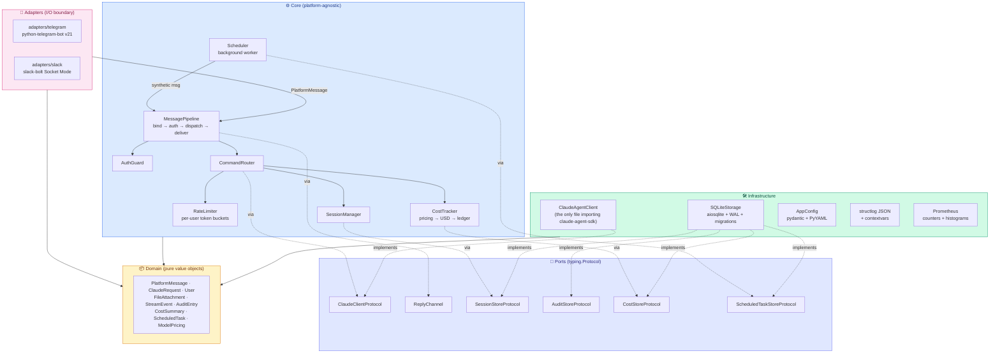
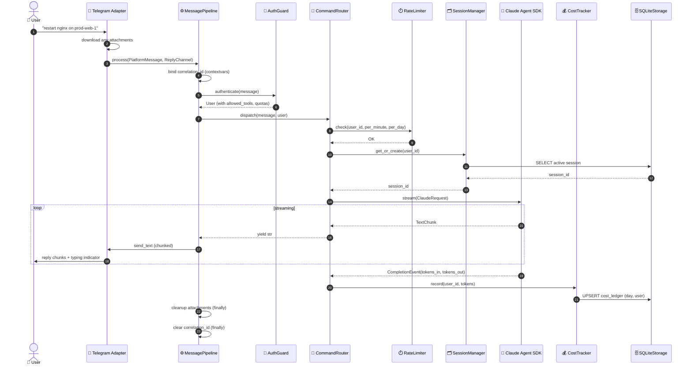

# Architecture

This page covers how datronis-relay is structured, why the structure was
chosen, and how a request flows through it from chat platform to Claude
and back.

## Clean Architecture with strict inward-pointing dependencies

The Domain layer is pure dataclasses and enums with no side effects. The
Core defines use cases and Protocols (ports). Infrastructure implements
those Protocols against real I/O (SQLite, the Claude SDK, Prometheus).
Adapters sit at the edge, translate platform-specific events into
`PlatformMessage`s, and hand them to `MessagePipeline` — they never
reach into the core.



**Why this matters:** adding a new chat platform (Discord, WhatsApp,
Matrix) is an ~80-line exercise: implement `ChatAdapterProtocol` + write
a `ReplyChannel` + subclass the shared `ReplyChannelContract` test
suite. Zero core changes.

---

## Request flow

A realtime message from a Telegram user flows through exactly these
stages. Scheduled tasks take the same path, with the only difference
being that the scheduler synthesizes the `PlatformMessage` and
reconstructs the `ReplyChannel` from a stored `channel_ref`.



**Every numbered step is testable in isolation.** The contract between
any two components is a Protocol, so unit tests inject fakes at any
boundary without reaching into library internals.

---

## Tech Stack

Single stack, explicit versions. Every dependency is pinned with a
minimum and an upper bound to prevent silent major bumps.

### Backend (Python bot)

| Layer | Technology | Version | Role |
|---|---|---|---|
| **Language / Runtime** | Python | `>= 3.11` | Async-native, type-rich, data-science-friendly ecosystem |
| **Concurrency** | `asyncio` | stdlib | Single event loop, structured task lifecycle |
| **LLM Agent** | `claude-agent-sdk` | `>= 0.0.14` | Official Anthropic Agent SDK (tool loop, streaming, sessions) |
| **Telegram** | `python-telegram-bot` | `>= 21.0, < 22` | Long-polling, file downloads, typing indicators |
| **Slack** | `slack-bolt` | `>= 1.18, < 2` | Socket Mode (no public webhook needed) |
| **HTTP (Slack downloads)** | `aiohttp` | transitive | Authed `url_private` downloads |
| **Data validation** | `pydantic` v2 | `>= 2.6, < 3` | Config schema, `SecretStr`, typed dataclasses |
| **Configuration** | `PyYAML` | `>= 6.0` | Human-friendly multi-user config files |
| **Database** | `aiosqlite` + SQLite | `>= 0.20` | WAL mode, numbered migrations, 4 tables, 5 indexes |
| **Structured logging** | `structlog` | `>= 24.1` | JSON renderer, contextvars for correlation IDs |
| **Metrics** | `prometheus-client` | `>= 0.20` | Counters + histograms, optional HTTP exposition |
| **Packaging / Build** | `hatchling` | PEP 517 | Wheel + sdist builder |
| **Testing** | `pytest` + `pytest-asyncio` + `pytest-cov` | `>= 8.0` / `>= 0.23` | Async tests, coverage reporting |
| **Type checking** | `mypy` | `>= 1.9` strict mode | `--strict` with zero errors |
| **Linting + Formatting** | `ruff` | `>= 0.4` | Replaces `flake8`, `black`, `isort` |
| **Documentation site** | `mkdocs-material` | `>= 9.5` | Auto-deployed via GitHub Actions to GitHub Pages |
| **CI/CD** | GitHub Actions | — | `ci.yml`, `release.yml` (trusted PyPI publishing), `docs.yml` |
| **Containerization** | Docker | multi-stage | `python:3.11-slim` base, non-root user, read-only rootfs |
| **Service management** | `systemd` | — | Hardened unit (`NoNewPrivileges`, `ProtectSystem=strict`, `MemoryDenyWriteExecute`) |

### Frontend (Next.js admin dashboard)

| Layer | Technology | Version | Role |
|---|---|---|---|
| **Framework** | `next` | `^15.3` | App Router, React Server Components, file-system routing |
| **UI runtime** | `react`, `react-dom` | `^19.1` | React 19 — concurrent features, async components |
| **UI primitives** | `@radix-ui/themes` | `^3.2` | Accessible Radix design system (Card, Table, Dialog, Select, Switch, AlertDialog, Toast) |
| **Icons** | `@radix-ui/react-icons` | `^1.3` | Consistent 16-px icon set |
| **Styling** | `tailwindcss` | `^4.1` | Utility-first with logical properties for future RTL |
| **i18n** | `next-intl` | `^4.1` | ICU messages, SSR-safe, 6 locales |
| **Theme** | `next-themes` | `^0.4` | Dark/light with SSR-safe hydration |
| **Forms** | `react-hook-form` + `@hookform/resolvers` | `^7.54` / `^3.10` | Uncontrolled inputs, zodResolver adapter |
| **Validation** | `zod` | `^3.24` | Single source of truth for API response shapes + form validation |
| **Charts** | `recharts` | `^3.8` | Daily cost bar chart, lazy-loaded via `next/dynamic` |
| **Utilities** | `clsx`, `tailwind-merge` | `^2.1`, `^3.0` | `cn()` helper for conditional classes |
| **Testing** | `vitest` | `^3.1` | Node-env unit tests, 108 tests, ~650 ms full run |
| **Linting** | `eslint` + `eslint-config-next` + `next/typescript` | `^9` / `^15` | Flat config, zero warnings gate |
| **Type checking** | `typescript` | `^5.7` | Strict mode, `noEmit`, zero `any` |
| **Package manager** | `pnpm` | `10.x` | Fast, strict, disk-efficient |

---

## Technology decisions

Every significant dependency was picked after comparing at least two
alternatives. The tables below capture the *why*, not just the what.

### Language: Python vs Go vs Rust vs TypeScript vs C++

| Option | Pros | Cons | Verdict |
|---|---|---|---|
| **Python 3.11+** ✅ | Official `claude-agent-sdk`. Native Whisper/Coqui for Phase 1.1 voice. Mature DevOps ecosystem (Paramiko, Ansible heritage). Low OSS contribution barrier. `mypy --strict` gets ~90% of TS's type safety. | Runtime deps (solved by Docker/pipx). GIL (irrelevant for I/O-bound workload). | **Chosen** |
| TypeScript | Official Agent SDK. Best-in-class type system. Great Telegram/Slack libs. | Voice stack falls apart (no mature local Whisper). DevOps ecosystem is thinner. `node_modules` supply-chain risk. | Strong second place |
| Go | Single static binary. Best SSH library of any language. Trivial self-host. | **No official Agent SDK** — would have to reimplement the tool loop forever. No native voice inference. Glue-code ergonomics are poor. | Rejected |
| Rust | Memory safety, zero-cost abstractions. | No official Agent SDK. Compile times hurt iteration. Massively shrinks the OSS contributor pool for glue code. | Rejected |
| C++ | — | Wrong abstraction level. Memory-unsafe by default. Highest contribution barrier. | Rejected immediately |

**Decisive factor:** the `claude-agent-sdk` has first-class Python +
TypeScript support only. Everything else means reimplementing the Agent
tool loop, session resume, and MCP handshake — a permanent maintenance
tax.

### Architecture: MVC vs Hexagonal vs Clean Architecture

| Pattern | Verdict |
|---|---|
| MVC | Fine for web apps; awkward for chat-ops where "views" are streamed text across platforms. |
| Hexagonal | Conceptually identical to Clean Architecture, slightly less opinionated naming. |
| **Clean Architecture** ✅ | Explicit layering, dependency inversion, natural home for `typing.Protocol`s as ports. The pattern that makes a second adapter literally an 80-line exercise. |

### Database: SQLite vs Postgres vs Redis vs DuckDB

| Option | Verdict |
|---|---|
| **SQLite + `aiosqlite`** ✅ | Zero external infrastructure. WAL mode gives concurrent readers and crash safety. Perfect fit for a self-hosted bot with <1000 users per instance. Schema migrations are checked-in SQL files. |
| Postgres + `asyncpg` | Overkill for the target deployment shape. Adds a process dependency. |
| Redis | Not durable enough for an append-only audit log. |
| DuckDB | Optimized for OLAP, not transactional writes. |

### Config format: Env-only vs TOML vs YAML

| Option | Verdict |
|---|---|
| **YAML + env overrides for secrets** ✅ | Human-friendly for per-user allowlists, tool permissions, and pricing tables. Secrets stay in env vars so `config.yaml` is safe to commit. |
| Env-only | Impossible to express deep nesting (per-user rate limits). |
| TOML | Python-native but less ergonomic for deeply nested structures. |

### Chat SDK: `python-telegram-bot` vs `aiogram` vs `pyTelegramBotAPI`

| Option | Verdict |
|---|---|
| **`python-telegram-bot` v21+** ✅ | Native asyncio, battle-tested, huge community, built-in file download, clean `ApplicationBuilder` API. |
| `aiogram` | Async-first but smaller community and fewer third-party resources. |
| `pyTelegramBotAPI` | Sync by default, older idioms. |

### Slack SDK: `slack-bolt` Socket Mode vs raw `slack_sdk` webhooks

| Option | Verdict |
|---|---|
| **`slack-bolt` Socket Mode** ✅ | Outbound websocket means no public webhook URL, no TLS certificate to manage, works behind NAT. Decorator-based event handlers. Matches Telegram long-polling architecturally. |
| Raw `slack_sdk` with HTTP webhooks | Requires a public URL and a reverse proxy. Self-hosters hate this. |

### Logging: stdlib `logging` vs `loguru` vs `structlog`

| Option | Verdict |
|---|---|
| **`structlog`** ✅ | Structured JSON output, composable processor pipeline, `contextvars`-backed correlation IDs, safe under asyncio concurrent Tasks. |
| stdlib `logging` | Verbose, no JSON by default, clunky filter composition. |
| `loguru` | Nice defaults but less composable, non-standard API. |

### Validation: dataclasses vs `attrs` vs `pydantic` v2

| Option | Verdict |
|---|---|
| Domain types: **frozen `dataclasses`** ✅ | No runtime validation overhead in the hot path; immutable by default; slots for memory. |
| Config validation: **`pydantic` v2** ✅ | Declarative, fast (Rust core), `SecretStr` for tokens, great error messages for malformed YAML. |

Both are used — one in the domain (for speed), one at the I/O boundary
(for validation). Right tool for each layer.

### Lint + Format: `flake8 + black + isort` vs `ruff`

| Option | Verdict |
|---|---|
| **`ruff`** ✅ | Single Rust binary replaces flake8, black, and isort. ~100× faster. Consistent rule set. Auto-fix mode. |
| flake8 + black + isort | Three tools, three configs, three dependencies to keep in sync. |

### Type checker: `mypy --strict` vs `pyright` vs `pyre`

| Option | Verdict |
|---|---|
| **`mypy --strict`** ✅ | Community standard for published Python libraries. Integrates with every editor. Strict mode catches virtually all my own errors. |
| `pyright` | Faster and more thorough but requires Node for the CLI, less common in OSS Python. |
| `pyre` | Facebook-driven, rare outside their ecosystem. |

---

## Project structure

```
datronis-relay/
├── 📄 README.md                                     — landing page
├── 📄 LICENSE                                       — MIT
├── 📄 CONTRIBUTING.md                               — dev setup, coding standards
├── 📄 CODE_OF_CONDUCT.md                            — Contributor Covenant v2.1
├── 📄 SECURITY.md                                   — private reporting process, SLA
├── 🔧 pyproject.toml                                — project metadata, deps, ruff/mypy/pytest config
├── 🔧 mkdocs.yml                                    — documentation site config
├── 🔧 config.example.yaml                           — example configuration (copy to config.yaml)
├── 🔧 .env.example                                  — example env file (copy to .env)
├── 🐳 Dockerfile                                    — multi-stage, non-root, Python 3.11-slim, Claude Code native installer
├── 🐳 docker-compose.yml                            — read-only rootfs, tmpfs /tmp, hardened
│
├── 📁 src/datronis_relay/             — main package
│   ├── __init__.py                    — __version__ = "1.0.0"
│   ├── __main__.py                    — entrypoint: python -m datronis_relay
│   ├── main.py                        — composition root (pure function of AppConfig)
│   │
│   ├── 📦 domain/                     — pure value objects, no side effects
│   │   ├── ids.py                     — UserId, SessionId, CorrelationId (NewType)
│   │   ├── messages.py                — PlatformMessage, ClaudeRequest, Platform, MessageKind
│   │   ├── user.py                    — User (immutable record with permissions + quotas)
│   │   ├── attachments.py             — FileAttachment (one type for files + images)
│   │   ├── stream_events.py           — TextChunk | CompletionEvent discriminated union
│   │   ├── audit.py                   — AuditEntry + AuditEventType
│   │   ├── cost.py                    — CostSummary
│   │   ├── pricing.py                 — ModelPricing (with cost() method)
│   │   ├── scheduled_task.py          — ScheduledTask
│   │   └── errors.py                  — RelayError hierarchy + ErrorCategory
│   │
│   ├── ⚙️ core/                       — platform-agnostic use cases + ports
│   │   ├── ports.py                   — all Protocols (ClaudeClient, Session/Audit/Cost/Scheduled store)
│   │   ├── reply_channel.py           — ReplyChannel Protocol (send_text, typing, max_length)
│   │   ├── message_pipeline.py        — THE hub: bind → auth → dispatch → deliver → cleanup
│   │   ├── auth.py                    — AuthGuard.authenticate(message) -> User
│   │   ├── session_manager.py         — per-user asyncio.Lock map + get_or_create
│   │   ├── command_router.py          — /ask /cost /schedule /help /status /stop dispatch
│   │   ├── rate_limiter.py            — per-user two-bucket (minute + day) token limiter
│   │   ├── cost_tracker.py            — pricing → USD → ledger; unknown model → 0.0 + warning
│   │   ├── scheduler.py               — background worker + AdapterRegistry
│   │   ├── interval_parser.py         — parse_interval("5m") → 300 seconds
│   │   └── chunking.py                — platform-agnostic message chunking with continuation marker
│   │
│   ├── 🛠️ infrastructure/             — concrete port implementations
│   │   ├── config.py                  — AppConfig pydantic model + YAML loader + env overrides
│   │   ├── sqlite_storage.py          — aiosqlite, WAL, 4 ports implemented
│   │   ├── migrations/
│   │   │   ├── 0001_init.sql          — users, sessions, audit_log, cost_ledger
│   │   │   └── 0002_scheduled_tasks.sql
│   │   ├── session_store.py           — InMemorySessionStore (test-only)
│   │   ├── claude_client.py           — the ONLY file that imports claude-agent-sdk
│   │   ├── logging.py                 — structlog + contextvars
│   │   └── metrics.py                 — Prometheus counters + histogram
│   │
│   ├── 🔌 adapters/                   — I/O boundary
│   │   ├── telegram/                  — long-polling adapter
│   │   └── slack/                     — Socket Mode adapter
│   │
│   └── 🧙 cli/                        — CLI subcommands (setup wizard, doctor)
│       ├── prompts.py                 — Prompter Protocol
│       ├── setup.py                   — interactive first-run wizard
│       └── doctor.py                  — config + connectivity validator
│
├── 🧪 tests/                          — pytest suite
│   ├── unit/                          — fakes injected at Protocol boundaries
│   └── integration/                   — real SQLite, real pipeline
│
├── 📊 scripts/
│   └── benchmark.py                   — standalone dispatch + SQLite + concurrency benchmarks
│
├── 🌐 ui/                             — Next.js 15 admin dashboard
│   ├── package.json                   — pnpm, Next 15, React 19, Radix UI, next-intl, zod, recharts, vitest
│   ├── messages/                      — i18n bundles (6 locales: en, de, es, fr, zh, ja)
│   ├── src/
│   │   ├── app/[locale]/              — per-locale route segment
│   │   ├── components/                — layout, ui primitives, users, tasks, adapters, cost, audit, settings
│   │   ├── hooks/use-api.ts           — minimal SWR-style hook
│   │   ├── i18n/                      — routing.ts + request.ts
│   │   └── lib/                       — schemas, api client, csv, interval helpers
│   └── tests/unit/                    — 108 Vitest tests (pure logic)
│
├── 📚 docs/                           — mkdocs-material site (this directory)
│   ├── index.md
│   ├── quickstart.md
│   ├── slack_setup.md
│   ├── architecture.md                — this file
│   ├── engineering.md                 — challenges & key achievements
│   ├── testing.md                     — test categories + quality gates
│   ├── web-dashboard.md               — Next.js dashboard deep-dive
│   ├── installation.md                — manual install + commands reference
│   ├── use-cases.md                   — personas + scenarios
│   ├── roadmap.md                     — backend + frontend phases
│   ├── api_reference.md
│   ├── versioning.md
│   ├── performance.md
│   ├── security.md                    — STRIDE threat model
│   ├── release_checklist.md
│   └── changelog.md
│
├── 📁 examples/
│   └── systemd/datronis-relay.service — hardened systemd unit
│
└── 📁 .github/
    ├── workflows/
    │   ├── ci.yml                     — lint + typecheck + test matrix + build
    │   ├── release.yml                — tag-triggered: build, trusted PyPI publish, GH release
    │   └── docs.yml                   — mkdocs --strict build, deploy to GitHub Pages
    ├── ISSUE_TEMPLATE/                — structured intake (bug, feature, config)
    └── PULL_REQUEST_TEMPLATE.md
```
